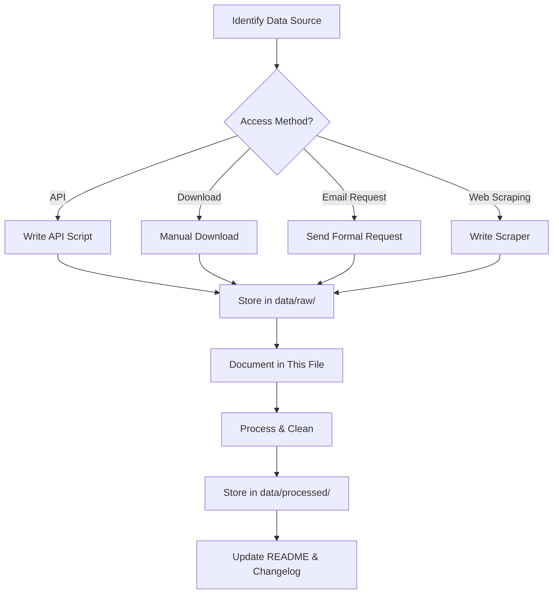

# Data Acquisition Plan
## CELIOS8: Teduhi Ruang Kota Kami — PLTS Atap Dual-Use Infrastructure

**Tanggal:** 19 Juni 2026  
**Status:** 🟡 Planning Phase  
**Total Sumber:** [To be counted]

---

## 📋 Overview

Dokumen ini merupakan master log untuk semua data yang dibutuhkan dalam riset potensi PLTS atap dual-use infrastructure di Jabodetabek. Setiap sumber data didokumentasikan dengan status akuisisi, metode akses, dan output yang dihasilkan.

---

## 🎯 Data Requirements Summary

### Data Utama yang Dibutuhkan:

1. **Infrastruktur Transportasi**
   - Halte TransJakarta (lokasi, dimensi, jumlah)
   - Stasiun KRL (lokasi, area peron)
   - Stasiun MRT & LRT (lokasi, area kanopi)
   - Jembatan Penyeberangan Orang / JPO (lokasi, dimensi)

2. **Infrastruktur Parkir & Pedestrian**
   - Parking lot terbuka (mall, perkantoran, kampus, RS)
   - Gedung parkir bertingkat / MSCP
   - Koridor pedestrian (lokasi, panjang, lebar)

3. **Data Spasial / GIS**
   - Satellite imagery Jabodetabek
   - Administrative boundaries
   - Building footprints
   - Land use / land cover

4. **Data Energi**
   - Konsumsi listrik Jabodetabek
   - Tarif listrik PLN
   - Solar irradiation data (Peak Sun Hours)
   - Existing solar PV installations

5. **Data Finansial**
   - CAPEX solar PV (carport vs rooftop)
   - OPEX maintenance costs
   - Regulatory framework (PERMEN ESDM, dll)

6. **Data Lingkungan**
   - Temperature data (untuk UHI analysis)
   - Air quality (optional)

7. **Data Demografi & Ekonomi**
   - Population density
   - Economic activity
   - Transportation ridership

---

## 🗂️ Data Sources Inventory

### A. Portal Pemerintah Pusat

| # | Portal | URL | Tipe | Metode Akses | Status | Data Target | Keterangan |
|:---:|---|---|:---:|:---:|:---:|---|---|
| 1 | **BPS WebAPI** | `https://webapi.bps.go.id/v1/api` | Pemerintah | API (key required) | ⚠️ **BELUM DICOBA** | Konsumsi listrik per kapita, PDRB, populasi Jabodetabek | API key gratis via bps.go.id |
| 2 | **PLN Statistics** | `https://web.pln.co.id/statics` | BUMN | Web scraping / PDF download | ⚠️ **BELUM DICOBA** | Penjualan listrik per sektor, tarif listrik | Data publikasi tahunan |
| 3 | **Kementerian ESDM** | `https://www.esdm.go.id` | Pemerintah | Download publikasi | ⚠️ **BELUM DICOBA** | Kebijakan energi terbarukan, PLTS atap existing | Outlook Energi Indonesia, Statistik EBTKE |
| 4 | **One Map Indonesia** | `https://geoportal.esdm.go.id` / `https://tanahair.indonesia.go.id` | Pemerintah | Web portal + download | ⚠️ **BELUM DICOBA** | Batas administrasi, peta dasar Jakarta | Geoportal BIG/KLHK |
| 5 | **Jakarta Smart City** | `https://smartcity.jakarta.go.id` / `https://data.jakarta.go.id` | Pemda DKI | Portal open data | ⚠️ **BELUM DICOBA** | Data infrastruktur kota, transportasi, demografi | Open Data Jakarta |

---

### B. Portal Pemerintah Daerah (Jabodetabek)

| # | Portal | URL | Tipe | Metode Akses | Status | Data Target | Keterangan |
|:---:|---|---|:---:|:---:|:---:|---|---|
| 6 | **Jakarta Open Data** | `https://data.jakarta.go.id` | Pemda DKI | CKAN API / download | ⚠️ **BELUM DICOBA** | Halte TransJ, JPO, data transportasi, bangunan | CKAN-based portal |
| 7 | **Jabar Open Data** | `https://opendata.jabarprov.go.id` | Pemda Jabar | CKAN API / download | ⚠️ **BELUM DICOBA** | Infrastruktur Bekasi, Depok, Bogor (Jabar portion) | Coverage Jabodetabek bagian Jabar |
| 8 | **Banten Open Data** | `https://opendata.bantenprov.go.id` | Pemda Banten | Web portal | ⚠️ **BELUM DICOBA** | Infrastruktur Tangerang, Tangerang Selatan | Coverage Jabodetabek bagian Banten |
| 9 | **Kota Bogor** | `https://data.kotabogor.go.id` | Pemkot Bogor | Web portal | ⚠️ **BELUM DICOBA** | Data kota Bogor | Infrastruktur kota |
| 10 | **Kota Depok** | `https://depok.go.id` | Pemkot Depok | Web portal / request | ⚠️ **BELUM DICOBA** | Data kota Depok | Infrastruktur kota |

---

### C. BUMN Transportasi & Infrastruktur

| # | Portal | URL | Tipe | Metode Akses | Status | Data Target | Keterangan |
|:---:|---|---|:---:|:---:|:---:|---|---|
| 11 | **PT TransJakarta** | `https://transjakarta.co.id` / request resmi | BUMD | Email / phone request | ⚠️ **BELUM DICOBA** | **PRIORITAS #1**: Jumlah halte (284), lokasi, dimensi kanopi, area per halte | Contact: humas@transjakarta.co.id |
| 12 | **PT KAI Commuter** | `https://www.krl.co.id` | BUMN | Email / phone request | ⚠️ **BELUM DICOBA** | **PRIORITAS #2**: 80+ stasiun KRL Jabodetabek, area peron, dimensi kanopi | Contact: customer care KAI |
| 13 | **PT MRT Jakarta** | `https://www.jakartamrt.co.id` | BUMD | Email / phone request | ⚠️ **BELUM DICOBA** | 13 stasiun MRT (Lebak Bulus - Bundaran HI), area kanopi, existing solar (if any) | Contact: corporate@jakartamrt.co.id |
| 14 | **PT Adhi Karya (LRT)** | `https://lrt.co.id` | BUMN | Email / phone request | ⚠️ **BELUM DICOBA** | 18 stasiun LRT Jabodebek, area kanopi stasiun | Operator LRT Jabodebek |
| 15 | **Dinas Perhubungan DKI** | `https://dishub.jakarta.go.id` | Pemda | PPID / request | ⚠️ **BELUM DICOBA** | JPO (jumlah, lokasi, dimensi), traffic data, mobility pattern | Data infrastruktur transportasi |

---

### D. Data Spasial & Satellite Imagery

| # | Portal | URL | Tipe | Metode Akses | Status | Data Target | Keterangan |
|:---:|---|---|:---:|:---:|:---:|---|---|
| 16 | **OpenStreetMap (OSM)** | `https://www.openstreetmap.org` | Open Data | Download via Overpass API | ⚠️ **BELUM DICOBA** | Building footprints, roads, POI (mall, hospital, campus, office) | Free, `overpass-api.de` |
| 17 | **Google Earth Engine** | `https://earthengine.google.com` | Google | Python API | ⚠️ **BELUM DICOBA** | Satellite imagery, land cover, NDVI, urban extent | Requires Google account |
| 18 | **Sentinel Hub** | `https://www.sentinel-hub.com` | ESA/EU | API (free tier) | ⚠️ **BELUM DICOBA** | Sentinel-2 imagery (10m resolution), land cover | Free for research with registration |
| 19 | **Planet Labs** | `https://www.planet.com` | Commercial | API (paid / education license) | 💰 **OPSIONAL** | High-res imagery (3m), monthly updates | Paid service, education discount available |
| 20 | **Google Maps API** | `https://developers.google.com/maps` | Google | API (paid / free quota) | ⚠️ **BELUM DICOBA** | Geocoding, Places API (untuk POI parking lot, mall, etc.) | Free quota: 28,000 requests/month |

---

### E. Data Solar & Meteorologi

| # | Portal | URL | Tipe | Metode Akses | Status | Data Target | Keterangan |
|:---:|---|---|:---:|:---:|:---:|---|---|
| 21 | **PVGIS (JRC Europe)** | `https://re.jrc.ec.europa.eu/pvgis.html` | Internasional | API (free) | ⚠️ **BELUM DICOBA** | **PRIORITAS #1**: Peak Sun Hours, solar irradiation Jabodetabek, production estimates | Free API, data 2005-2020 |
| 22 | **NASA POWER** | `https://power.larc.nasa.gov` | NASA | API (free) | ⚠️ **BELUM DICOBA** | Solar radiation data, temperature, precipitation | Alternative to PVGIS |
| 23 | **BMKG** | `https://www.bmkg.go.id` / `https://dataonline.bmkg.go.id` | Pemerintah | Web portal / request | ⚠️ **BELUM DICOBA** | Temperature data Jakarta (untuk UHI analysis), solar radiation | Requires formal request |
| 24 | **Solargis** | `https://solargis.com` | Commercial | Free maps / paid API | ⚠️ **BELUM DICOBA** | Solar resource maps Indonesia, GHI/DNI/GTI | Free: global maps. Paid: API + high-res data |

---

### F. Data Existing Solar PV Installations

| # | Portal | URL | Tipe | Metode Akses | Status | Data Target | Keterangan |
|:---:|---|---|:---:|:---:|:---:|---|---|
| 25 | **Bandara Soekarno-Hatta** | Press releases / airport authority | BUMN | OSINT / media | ⚠️ **BELUM DICOBA** | 3.3 MWp solar (Terminal 3), production data, lessons learned | Reference implementation |
| 26 | **Bandara Juanda Surabaya** | Press releases | BUMN | OSINT / media | ⚠️ **BELUM DICOBA** | 1.2 MWp solar, lessons learned | Reference implementation |
| 27 | **Stasiun KRL (existing solar)** | PT KAI press / media | BUMN | OSINT | ⚠️ **BELUM DICOBA** | Depok Baru, Lenteng Agung (50-200 kWp each) | Pilot projects |
| 28 | **IESR Database** | `https://iesr.or.id` | NGO | Email request | ⚠️ **BELUM DICOBA** | Database solar PV installations Indonesia (if exists) | Contact: info@iesr.or.id |

---

### G. Data Parkir & Komersial

| # | Portal | URL | Tipe | Metode Akses | Status | Data Target | Keterangan |
|:---:|---|---|:---:|:---:|:---:|---|---|
| 29 | **Google Maps Places API** | `https://developers.google.com/maps/documentation/places` | Google | API | ⚠️ **BELUM DICOBA** | POI: mall, shopping center, office building, hospital, university di Jabodetabek | Extract name, address, coordinates |
| 30 | **OSM POI** | Overpass API | Open Data | API | ⚠️ **BELUM DICOBA** | POI: `amenity=parking`, `building=commercial`, `amenity=hospital`, `amenity=university` | Filter by bbox Jabodetabek |
| 31 | **Manual Survey (Sample)** | Field visit | Primary data | Manual | ⚠️ **BELUM DICOBA** | Sample measurement: area parkir mall (e.g., 5-10 locations) untuk validasi | Ground truthing |

---

### H. Data Finansial & Regulasi

| # | Portal | URL | Tipe | Metode Akses | Status | Data Target | Keterangan |
|:---:|---|---|:---:|:---:|:---:|---|---|
| 32 | **PERMEN ESDM 26/2021** | `https://jdih.esdm.go.id` | Pemerintah | Download PDF | ⚠️ **BELUM DICOBA** | Regulasi PLTS Atap: net-metering, kapasitas max, prosedur interkoneksi | Legal framework |
| 33 | **Solar EPC Companies** | Industry contacts | Private | Interview / quote request | ⚠️ **BELUM DICOBA** | Real CAPEX data: solar carport Rp/kWp, rooftop Rp/kWp, OPEX estimates | Contact: SUN Energy, Xurya, Inocycle |
| 34 | **PLN Tariff** | `https://web.pln.co.id` | BUMN | Web / publication | ⚠️ **BELUM DICOBA** | Electricity tariff 2025/2026: residential, commercial, industrial | For financial modeling |
| 35 | **Bank Indonesia** | `https://www.bi.go.id` | Pemerintah | Web / API | ⚠️ **BELUM DICOBA** | Discount rate, inflation rate (untuk NPV calculation) | Macroeconomic data |

---

### I. Studi Komparasi Internasional

| # | Portal | URL | Tipe | Metode Akses | Status | Data Target | Keterangan |
|:---:|---|---|:---:|:---:|:---:|---|---|
| 36 | **France Solar Law 2023** | Google Scholar / media | Internasional | OSINT | ⚠️ **BELUM DICOBA** | Law No. 2023-175: mandatory solar on parking lots >1,500m², implementation data | Case study |
| 37 | **Tokyo Solar Mandate** | Tokyo Metro Gov website | Internasional | OSINT | ⚠️ **BELUM DICOBA** | Tokyo's rooftop solar mandate (April 2022), buildings >2,000m² | Case study |
| 38 | **JR East Solar Stations** | JR East press releases | Internasional | OSINT | ⚠️ **BELUM DICOBA** | 30+ train stations with solar, total ~15 MWp, lessons learned | Case study |
| 39 | **Delhi Metro Solar** | DMRC reports | Internasional | OSINT | ⚠️ **BELUM DICOBA** | 31.4 MWp solar capacity across stations, financial model | Case study |

---

### J. Literatur & Research Papers

| # | Source | URL | Tipe | Metode Akses | Status | Data Target | Keterangan |
|:---:|---|---|:---:|:---:|:---:|---|---|
| 40 | **Siswanto et al. (2023)** | Scopus / ScienceDirect | Journal | University access / Sci-Hub | ⚠️ **BELUM DICOBA** | UHI Jakarta: spatio-temporal characteristics, temperature increase | Already cited in brief |
| 41 | **IRENA Reports** | `https://www.irena.org/publications` | Internasional | Free download | ⚠️ **BELUM DICOBA** | Solar PV cost trends, LCOE benchmarks, technology updates | Reference for financial modeling |
| 42 | **IEA PVPS Programme** | `https://iea-pvps.org` | Internasional | Free download | ⚠️ **BELUM DICOBA** | Solar carport case studies, best practices, technical reports | Reference for methodology |
| 43 | **Google Scholar** | `https://scholar.google.com` | Academic | Search | ⚠️ **BELUM DICOBA** | "solar carport", "urban solar potential", "parking lot solar", "dual-use infrastructure" | Literature review |

---

## 🎯 Priority Data Collection (Phase 1 — Next 2 Months)

### 🔥 **CRITICAL (Week 1-2)**

1. ✅ **TransJakarta halte data** (via email request ke PT TransJakarta)
   - Contact: humas@transjakarta.co.id
   - Data needed: List 284 halte + coordinates + canopy dimensions
   
2. ✅ **KRL station data** (via PT KAI Commuter)
   - Contact: KAI customer service / corporate
   - Data needed: 80+ stations + platform area + canopy area

3. ✅ **MRT & LRT station data** (via PT MRT Jakarta & Adhi Karya)
   - Contact: corporate@jakartamrt.co.id, lrt.co.id
   - Data needed: Station list + canopy area

4. ✅ **PVGIS API setup**
   - Register & test API for Jakarta coordinates
   - Extract Peak Sun Hours (PSH) data

### 📊 **HIGH PRIORITY (Week 3-4)**

5. ✅ **OpenStreetMap download** (Jabodetabek bbox)
   - Building footprints (for parking lot identification)
   - POI: mall, office, hospital, university
   - Roads & administrative boundaries

6. ✅ **Google Maps Places API**
   - Extract commercial parking locations
   - Mall, office building, hospital, campus

7. ✅ **JPO data** (via Dishub DKI)
   - Request via PPID: https://ppid.jakarta.go.id
   - Data: ~300 JPO locations + dimensions

### 🔬 **MEDIUM PRIORITY (Week 5-8)**

8. ✅ **Satellite imagery** (Google Earth Engine or Sentinel Hub)
   - Test GEE Python API
   - Download recent imagery for selected locations

9. ✅ **Solar EPC interviews**
   - Contact 3-5 companies for CAPEX quotes
   - Questions: carport vs rooftop cost, OPEX, typical PR

10. ✅ **Literature review**
    - Download 10-15 key papers
    - Summarize in `docs/literature-review/`

---

## 📈 Data Collection Workflow

### Standard Operating Procedure



### Data Documentation Standard

Setiap dataset yang diperoleh harus didokumentasikan:

1. **Update tabel di atas** dengan status ✅ BERHASIL
2. **Create metadata file** di `data/raw/[dataset_name]/README.md`:
   ```markdown
   # Dataset: [Name]
   
   **Source**: [URL]
   **Date Acquired**: YYYY-MM-DD
   **Format**: CSV/Excel/Shapefile/etc.
   **Size**: XX MB
   
   ## Fields Description
   | Field | Type | Description |
   |-------|------|-------------|
   | ... | ... | ... |
   
   ## Data Quality Notes
   - Completeness: ...
   - Accuracy: ...
   - Limitations: ...
   
   ## Processing Steps
   1. ...
   2. ...
   ```

3. **Update CHANGELOG.md**

---

## 📞 Contact Information

### Key Stakeholders for Data Request

| Organization | Contact Person | Email | Phone | Status |
|--------------|----------------|-------|-------|--------|
| PT TransJakarta | Humas | humas@transjakarta.co.id | (021) 1500 119 | ⏳ Not contacted |
| PT KAI Commuter | Customer Care | - | 121 | ⏳ Not contacted |
| PT MRT Jakarta | Corporate Comm | corporate@jakartamrt.co.id | (021) 2967 5000 | ⏳ Not contacted |
| Dinas Perhubungan DKI | PPID | ppid@jakarta.go.id | - | ⏳ Not contacted |
| IESR | Info | info@iesr.or.id | - | ⏳ Not contacted |

---

## 📊 Data Acquisition Status Dashboard

### Summary Statistics

| Status | Count | Percentage |
|--------|-------|------------|
| ✅ **Berhasil** | 0 | 0% |
| ⚠️ **Belum Dicoba / Planning** | 43 | 100% |
| ❌ **Gagal** | 0 | 0% |
| 🔒 **Membutuhkan Izin** | 0 | 0% |
| 💰 **Berbayar (Opsional)** | 2 | 5% |
| **TOTAL** | **43** | **100%** |

### By Category

| Category | Count |
|----------|-------|
| Pemerintah Pusat | 5 |
| Pemerintah Daerah | 5 |
| BUMN/BUMD | 5 |
| Data Spasial | 5 |
| Data Solar/Meteorologi | 4 |
| Existing Implementations | 4 |
| Data Parkir/Komersial | 3 |
| Finansial/Regulasi | 4 |
| Studi Komparasi | 4 |
| Literatur | 4 |

---

## 🔄 Update Log

### v1.0 — Initial Planning (23 Juni 2026)
- ✅ Created comprehensive data acquisition plan
- ✅ Identified 43 data sources across 10 categories
- ✅ Defined priority collection (Critical, High, Medium)
- ✅ Established documentation standards
- ⏳ Next: Begin contacting BUMN transportasi (TransJ, KAI, MRT)

---

## 📚 References

1. Data acquisition methodology adapted from CELIOS D3TLH Research
2. Best practices: World Bank Open Data Toolkit
3. GIS data standards: ISO 19115 (Geographic Information - Metadata)

---

**Document Prepared By**: Celios Research Team  
**Last Updated**: 23 Juni 2026  
**Next Review**: Weekly (every Monday)  
**Status**: 🟡 Active Planning
