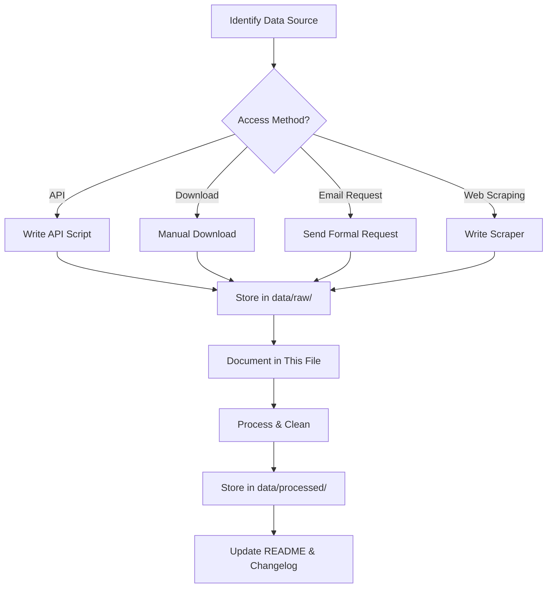

# Data Acquisition Plan
## CELIOS8: Teduhi Ruang Kota Kami — PLTS Atap Dual-Use Infrastructure

**Tanggal:** 19 Juni 2026  
**Status:** 🟡 Planning Phase  
**Total Sumber:** [To be counted]

---

## 🚨 REGIONAL EXPANSION UPDATE (24 September 2026)

### **Scope Resmi: JABODETABEK (Safety Buffer 4,000 Titik)**
- ✅ **JABODETABEK PENUH** (DKI Jakarta, Kota/Kab Bogor, Kota Depok, Kota/Kab Tangerang, Kota Tangerang Selatan, Kota/Kab Bekasi)
- 🎯 **Target Pagu Aman (Safety Buffer)**: **4,000 Titik Simpul Transportasi & Infrastruktur Publik**
- ⚠️ **DISCLAIMER VALIDASI**: Angka 4,000 titik adalah **plafon batas atas (safety buffer) belum tervalidasi riil di lapangan**, dipatok lebih tinggi agar anggaran riset tidak tekor saat pelaksanaan.

### **5 Dataset Paling Urgent (Skala Jabodetabek)**

| # | Dataset | Target Pagu Jabodetabek | Priority | Tool Status | Cakupan Regional (Estimasi Belum Tervalidasi) |
|---|---------|:-----------------------:|----------|-------------|-----------------------------------------------|
| **1** | **Halte BRT & Feeder Bus** | ~850 halte | 🔴 CRITICAL | ⚠️ In Progress | TransJakarta koridor/perbatasan + Biskita Bogor, Trans Patriot Bekasi, Tayo Tangerang, Feeder Depok/Tangsel |
| **2** | **Kantung Park & Ride & Parkir Terbuka** | 1,850+ lokasi | 🔴 CRITICAL | ⚠️ Need Filter | Kantung Park & Ride stasiun komuter Bodetabek + Terminal Bus Tipe A/B + Mall/RS/Kampus terbuka |
| **3** | **Stasiun Rel (KRL, MRT, LRT, Bandara)** | ~160 stasiun | 🔴 CRITICAL | 🟡 Need Split | KRL Commuter Line se-Jabodetabek + MRT + LRT (Jabodebek & Jakarta) + KA Bandara & KCIC |
| **4** | **Jembatan Penyeberangan Orang (JPO)** | ~640 JPO | 🟠 HIGH | 🔴 Missing | JPO arteri DKI Jakarta + JPO koridor jalan nasional/provinsi Bodetabek |
| **5** | **Peak Sun Hours & Solar Radiation** | BBOX Jabodetabek | 🔴 CRITICAL | ✅ Ready | PVGIS API (~4.8 - 5.0 h/day) mencakup 5 zona Jakarta + Bogor, Depok, Tangerang, Bekasi |

### **Infrastructure Focus (Skala Aglomerasi)**
Top 3 kategori yang menjadi tumpuan *dual-use solar*:
1. **Kantung Park & Ride Stasiun Komuter & Terminal Bus** - Lahan parkir terbuka terluas di Bodetabek, potensi ~150-250+ MWp
2. **~850 Halte BRT & Bus Shelter** - Kepemilikan BUMD/Dishub, visibilitas tinggi, potensi ~20-30 MWp
3. **~160 Stasiun Rel (KRL, LRT, MRT)** - Atap peron dan kanopi pejalan kaki, potensi ~15-25 MWp

**Total potensi estimasi regional**: ~250 - 500+ MWp dari 4,000 titik pagu safety buffer Jabodetabek.

---

## 📋 Overview

Dokumen ini merupakan master log untuk semua data yang dibutuhkan dalam riset potensi PLTS atap dual-use infrastructure di Jabodetabek. Setiap sumber data didokumentasikan dengan status akuisisi, metode akses, dan output yang dihasilkan.

---

## 🎯 Data Requirements Summary

### Data Utama yang Dibutuhkan:

1. **Infrastruktur Transportasi**
   - Halte TransJakarta (lokasi, dimensi, jumlah)
   - Stasiun KRL (lokasi, area peron)
   - Stasiun MRT & LRT (lokasi, area kanopi)
   - Jembatan Penyeberangan Orang / JPO (lokasi, dimensi)

2. **Infrastruktur Parkir & Pedestrian**
   - Parking lot terbuka (mall, perkantoran, kampus, RS)
   - Gedung parkir bertingkat / MSCP
   - Koridor pedestrian (lokasi, panjang, lebar)

3. **Infrastruktur Fasilitas Publik (Tambahan Kategori)**
   - Sekolah Negeri: SD, SMP, SMA/SMK Negeri (Data Dapodik / Disdik DKI & Bodetabek)
   - Universitas: Kampus PTN & PTS utama Jabodetabek (Data PDDIKTI)
   - Fasilitas Kesehatan: RSUD, RS Swasta, dan Puskesmas Kec./Kel. (SIRS Kemenkes & Dinkes)
   - Pasar Tradisional: Pasar rakyat & pasar binaan (Perumda Pasar Jaya & Disperindag)
   - Bandara: Fasilitas terminal & hanggar (PT Angkasa Pura II / InJourney Aviation)
   - Fasilitas Olahraga: Stadion & Gelanggang Olahraga / GOR (Dispora)

4. **Data Spasial / GIS**
   - Satellite imagery Jabodetabek
   - Administrative boundaries
   - Building footprints
   - Land use / land cover

4. **Data Energi**
   - Konsumsi listrik Jabodetabek
   - Tarif listrik PLN
   - Solar irradiation data (Peak Sun Hours)
   - Existing solar PV installations

5. **Data Finansial**
   - CAPEX solar PV (carport vs rooftop)
   - OPEX maintenance costs
   - Regulatory framework (PERMEN ESDM, dll)

6. **Data Lingkungan**
   - Temperature data (untuk UHI analysis)
   - Air quality (optional)

7. **Data Demografi & Ekonomi**
   - Population density
   - Economic activity
   - Transportation ridership

---

## 🗂️ Data Sources Inventory

### A. Portal Pemerintah Pusat

| # | Portal | URL | Tipe | Metode Akses | Status | Data Target | Tingkat Kemudahan | Keterangan |
|:---:|---|---|:---:|:---:|:---:|---|:---:|---|
| 1 | **BPS WebAPI** | `https://webapi.bps.go.id/v1/api` | Pemerintah | API (key required) | ⚠️ **BELUM DICOBA** | Konsumsi listrik per kapita, PDRB, populasi Jabodetabek | 🟢 **MUDAH** | API key gratis via bps.go.id, dokumentasi lengkap |
| 2 | **PLN Statistics** | `https://web.pln.co.id/statics` | BUMN | Web scraping / PDF download | ⚠️ **BELUM DICOBA** | Penjualan listrik per sektor, tarif listrik | 🟡 **SEDANG** | Data publikasi tahunan, perlu scraping PDF |
| 3 | **Kementerian ESDM** | `https://www.esdm.go.id` | Pemerintah | Download publikasi | ⚠️ **BELUM DICOBA** | Kebijakan energi terbarukan, PLTS atap existing | 🟡 **SEDANG** | Manual download PDF, perlu extract data |
| 4 | **One Map Indonesia** | `https://geoportal.esdm.go.id` / `https://tanahair.indonesia.go.id` | Pemerintah | Web portal + download | ⚠️ **BELUM DICOBA** | Batas administrasi, peta dasar Jakarta | 🟡 **SEDANG** | Portal kadang lambat, format shapefile |
| 5 | **Jakarta Smart City** | `https://smartcity.jakarta.go.id` / `https://data.jakarta.go.id` | Pemda DKI | Portal open data | ⚠️ **BELUM DICOBA** | Data infrastruktur kota, transportasi, demografi | 🟢 **MUDAH** | Open Data Jakarta, langsung download |

---

### B. Portal Pemerintah Daerah (Jabodetabek)

| # | Portal | URL | Tipe | Metode Akses | Status | Data Target | Tingkat Kemudahan | Keterangan |
|:---:|---|---|:---:|:---:|:---:|---|:---:|---|
| 6 | **Jakarta Open Data** | `https://data.jakarta.go.id` | Pemda DKI | CKAN API / download | ⚠️ **BELUM DICOBA** | Halte TransJ, JPO, data transportasi, bangunan | 🟢 **MUDAH** | CKAN-based portal, API ready, CSV/JSON |
| 7 | **Jabar Open Data** | `https://opendata.jabarprov.go.id` | Pemda Jabar | CKAN API / download | ⚠️ **BELUM DICOBA** | Infrastruktur Bekasi, Depok, Bogor (Jabar portion) | 🟢 **MUDAH** | CKAN API, coverage Jabodetabek bagian Jabar |
| 8 | **Banten Open Data** | `https://opendata.bantenprov.go.id` | Pemda Banten | Web portal | ⚠️ **BELUM DICOBA** | Infrastruktur Tangerang, Tangerang Selatan | 🟡 **SEDANG** | Portal kurang update, coverage Jabodetabek Banten |
| 9 | **Kota Bogor** | `https://data.kotabogor.go.id` | Pemkot Bogor | Web portal | ⚠️ **BELUM DICOBA** | Data kota Bogor | 🟡 **SEDANG** | Website sering offline, data terbatas |
| 10 | **Kota Depok** | `https://depok.go.id` | Pemkot Depok | Web portal / request | ⚠️ **BELUM DICOBA** | Data kota Depok | 🔴 **SULIT** | Tidak ada portal open data, perlu request formal |

---

### C. BUMN Transportasi & Infrastruktur

| # | Portal | URL | Tipe | Metode Akses | Status | Data Target | Tingkat Kemudahan | Keterangan |
|:---:|---|---|:---:|:---:|:---:|---|:---:|---|
| 11 | **PT TransJakarta** | `https://transjakarta.co.id` / request resmi | BUMD | Email / phone request | ⚠️ **BELUM DICOBA** | **PRIORITAS #1**: Jumlah halte (284), lokasi, dimensi kanopi, area per halte | 🔴 **SULIT** | Perlu request formal, data tidak public |
| 12 | **PT KAI Commuter** | `https://www.krl.co.id` | BUMN | Email / phone request | ⚠️ **BELUM DICOBA** | **PRIORITAS #2**: 80+ stasiun KRL Jabodetabek, area peron, dimensi kanopi | 🔴 **SULIT** | Perlu request formal, customer care KAI |
| 13 | **PT MRT Jakarta** | `https://www.jakartamrt.co.id` | BUMD | Email / phone request | ⚠️ **BELUM DICOBA** | 13 stasiun MRT (Lebak Bulus - Bundaran HI), area kanopi, existing solar (if any) | 🔴 **SULIT** | Perlu request formal via corporate@jakartamrt.co.id |
| 14 | **PT Adhi Karya (LRT)** | `https://lrt.co.id` | BUMN | Email / phone request | ⚠️ **BELUM DICOBA** | 18 stasiun LRT Jabodebek, area kanopi stasiun | 🔴 **SULIT** | Operator LRT, data tidak public |
| 15 | **Dinas Perhubungan DKI** | `https://dishub.jakarta.go.id` | Pemda | PPID / request | ⚠️ **BELUM DICOBA** | JPO (jumlah, lokasi, dimensi), traffic data, mobility pattern | 🟡 **SEDANG** | Bisa via PPID ppid.jakarta.go.id, proses 14 hari |

---

### D. Data Spasial & Satellite Imagery

| # | Portal | URL | Tipe | Metode Akses | Status | Data Target | Tingkat Kemudahan | Keterangan |
|:---:|---|---|:---:|:---:|:---:|---|:---:|---|
| 16 | **OpenStreetMap (OSM)** | `https://www.openstreetmap.org` | Open Data | Download via Overpass API | ⚠️ **BELUM DICOBA** | Building footprints, roads, POI (mall, hospital, campus, office) | 🟢 **SANGAT MUDAH** | Free API, dokumentasi lengkap, Python library (OSMnx) |
| 16b| **Overture Maps / Bing**| `https://overturemaps.org` | Open Data | Download GeoParquet | ⚠️ **BELUM DICOBA** | Building footprints offline masif untuk *Local Spatial Join* | 🟡 **SEDANG** | Solusi gratis tanpa limit API |
| 16c| **Google Solar API** | `https://developers.google.com` | Google | API (Berbayar) | 💰 **OPSIONAL** | Luas atap, efisiensi bayangan, potensi Solar MWh | 🟢 **SANGAT MUDAH** | Alternatif super premium dan instan |
| 17 | **Google Earth Engine** | `https://earthengine.google.com` | Google | Python API | ⚠️ **BELUM DICOBA** | Satellite imagery, land cover, NDVI, urban extent | 🟡 **SEDANG** | Perlu Google account + learning curve API |
| 18 | **Sentinel Hub** | `https://www.sentinel-hub.com` | ESA/EU | API (free tier) | ⚠️ **BELUM DICOBA** | Sentinel-2 imagery (10m resolution), land cover | 🟡 **SEDANG** | Free tier terbatas, perlu registrasi |
| 19 | **Planet Labs** | `https://www.planet.com` | Commercial | API (paid / education license) | 💰 **OPSIONAL** | High-res imagery (3m), monthly updates | 🔴 **SULIT** | Paid service, education discount available |
| 20 | **Google Maps API** | `https://developers.google.com/maps` | Google | API (paid / free quota) | ⚠️ **BELUM DICOBA** | Geocoding, Places API (untuk POI parking lot, mall, etc.) | 🟢 **MUDAH** | Free quota 28k requests/month, perlu billing setup |

---

### E. Data Solar & Meteorologi

| # | Portal | URL | Tipe | Metode Akses | Status | Data Target | Tingkat Kemudahan | Keterangan |
|:---:|---|---|:---:|:---:|:---:|---|:---:|---|
| 21 | **PVGIS (JRC Europe)** | `https://re.jrc.ec.europa.eu/pvgis.html` | Internasional | API (free) | ⚠️ **BELUM DICOBA** | **PRIORITAS #1**: Peak Sun Hours, solar irradiation Jabodetabek, production estimates | 🟢 **SANGAT MUDAH** | Free API, dokumentasi lengkap, Python requests |
| 22 | **NASA POWER** | `https://power.larc.nasa.gov` | NASA | API (free) | ⚠️ **BELUM DICOBA** | Solar radiation data, temperature, precipitation | 🟢 **MUDAH** | Free API, dokumentasi bagus, no registration |
| 23 | **BMKG** | `https://www.bmkg.go.id` / `https://dataonline.bmkg.go.id` | Pemerintah | Web portal / request | ⚠️ **BELUM DICOBA** | Temperature data Jakarta (untuk UHI analysis), solar radiation | 🔴 **SULIT** | Perlu request formal, proses lama |
| 24 | **Solargis** | `https://solargis.com` | Commercial | Free maps / paid API | ⚠️ **BELUM DICOBA** | Solar resource maps Indonesia, GHI/DNI/GTI | 🟡 **SEDANG** | Free maps bisa screenshot, paid API mahal |

---

### F. Data Existing Solar PV Installations

| # | Portal | URL | Tipe | Metode Akses | Status | Data Target | Tingkat Kemudahan | Keterangan |
|:---:|---|---|:---:|:---:|:---:|---|:---:|---|
| 25 | **Bandara Soekarno-Hatta** | Press releases / airport authority | BUMN | OSINT / media | ⚠️ **BELUM DICOBA** | 3.3 MWp solar (Terminal 3), production data, lessons learned | 🟡 **SEDANG** | Data dari press release + media, manual scraping |
| 26 | **Bandara Juanda Surabaya** | Press releases | BUMN | OSINT / media | ⚠️ **BELUM DICOBA** | 1.2 MWp solar, lessons learned | 🟡 **SEDANG** | Data dari press release + media |
| 27 | **Stasiun KRL (existing solar)** | PT KAI press / media | BUMN | OSINT | ⚠️ **BELUM DICOBA** | Depok Baru, Lenteng Agung (50-200 kWp each) | 🟡 **SEDANG** | Data dari media, perlu konfirmasi PT KAI |
| 28 | **IESR Database** | `https://iesr.or.id` | NGO | Email request | ⚠️ **BELUM DICOBA** | Database solar PV installations Indonesia (if exists) | 🟡 **SEDANG** | Email ke info@iesr.or.id, response time tidak pasti |

---

### G. Data Parkir & Komersial

| # | Portal | URL | Tipe | Metode Akses | Status | Data Target | Tingkat Kemudahan | Keterangan |
|:---:|---|---|:---:|:---:|:---:|---|:---:|---|
| 29 | **Google Maps Places API** | `https://developers.google.com/maps/documentation/places` | Google | API | ⚠️ **BELUM DICOBA** | POI: mall, shopping center, office building, hospital, university di Jabodetabek | 🟢 **MUDAH** | Free quota, dokumentasi lengkap, Python library |
| 30 | **OSM POI** | Overpass API | Open Data | API | ⚠️ **BELUM DICOBA** | POI: `amenity=parking`, `building=commercial`, `amenity=hospital`, `amenity=university` | 🟢 **SANGAT MUDAH** | Gratis unlimited, Python OSMnx library |
| 31 | **Manual Survey (Sample)** | Field visit | Primary data | Manual | ⚠️ **BELUM DICOBA** | Sample measurement: area parkir mall (e.g., 5-10 locations) untuk validasi | 🔴 **SULIT** | Perlu field visit, time consuming |

---

### H. Data Finansial & Regulasi

| # | Portal | URL | Tipe | Metode Akses | Status | Data Target | Tingkat Kemudahan | Keterangan |
|:---:|---|---|:---:|:---:|:---:|---|:---:|---|
| 32 | **PERMEN ESDM 26/2021** | `https://jdih.esdm.go.id` | Pemerintah | Download PDF | ⚠️ **BELUM DICOBA** | Regulasi PLTS Atap: net-metering, kapasitas max, prosedur interkoneksi | 🟢 **SANGAT MUDAH** | Download langsung PDF, legal framework |
| 33 | **Solar EPC Companies** | Industry contacts | Private | Interview / quote request | ⚠️ **BELUM DICOBA** | Real CAPEX data: solar carport Rp/kWp, rooftop Rp/kWp, OPEX estimates | 🟡 **SEDANG** | Perlu email/call ke SUN Energy, Xurya, Inocycle |
| 34 | **PLN Tariff** | `https://web.pln.co.id` | BUMN | Web / publication | ⚠️ **BELUM DICOBA** | Electricity tariff 2025/2026: residential, commercial, industrial | 🟢 **MUDAH** | Web scraping atau download PDF tarif |
| 35 | **Bank Indonesia** | `https://www.bi.go.id` | Pemerintah | Web / API | ⚠️ **BELUM DICOBA** | Discount rate, inflation rate (untuk NPV calculation) | 🟢 **MUDAH** | API tersedia, macroeconomic data public |

---

### I. Studi Komparasi Internasional

| # | Portal | URL | Tipe | Metode Akses | Status | Data Target | Tingkat Kemudahan | Keterangan |
|:---:|---|---|:---:|:---:|:---:|---|:---:|---|
| 36 | **France Solar Law 2023** | Google Scholar / media | Internasional | OSINT | ⚠️ **BELUM DICOBA** | Law No. 2023-175: mandatory solar on parking lots >1,500m², implementation data | 🟢 **MUDAH** | Banyak artikel media + Google Scholar |
| 37 | **Tokyo Solar Mandate** | Tokyo Metro Gov website | Internasional | OSINT | ⚠️ **BELUM DICOBA** | Tokyo's rooftop solar mandate (April 2022), buildings >2,000m² | 🟢 **MUDAH** | Website pemerintah Tokyo (English version) |
| 38 | **JR East Solar Stations** | JR East press releases | Internasional | OSINT | ⚠️ **BELUM DICOBA** | 30+ train stations with solar, total ~15 MWp, lessons learned | 🟡 **SEDANG** | Press release JR East, mungkin perlu translate JP |
| 39 | **Delhi Metro Solar** | DMRC reports | Internasional | OSINT | ⚠️ **BELUM DICOBA** | 31.4 MWp solar capacity across stations, financial model | 🟢 **MUDAH** | DMRC annual reports available online |

---

### J. Literatur & Research Papers

| # | Source | URL | Tipe | Metode Akses | Status | Data Target | Tingkat Kemudahan | Keterangan |
|:---:|---|---|:---:|:---:|:---:|---|:---:|---|
| 40 | **Siswanto et al. (2023)** | Scopus / ScienceDirect | Journal | University access / Sci-Hub | ⚠️ **BELUM DICOBA** | UHI Jakarta: spatio-temporal characteristics, temperature increase | 🟡 **SEDANG** | Perlu akses universitas atau Sci-Hub |
| 41 | **IRENA Reports** | `https://www.irena.org/publications` | Internasional | Free download | ⚠️ **BELUM DICOBA** | Solar PV cost trends, LCOE benchmarks, technology updates | 🟢 **SANGAT MUDAH** | Free download, dokumentasi lengkap |
| 42 | **IEA PVPS Programme** | `https://iea-pvps.org` | Internasional | Free download | ⚠️ **BELUM DICOBA** | Solar carport case studies, best practices, technical reports | 🟢 **SANGAT MUDAH** | Free download, reference methodology |
| 43 | **Google Scholar** | `https://scholar.google.com` | Academic | Search | ⚠️ **BELUM DICOBA** | "solar carport", "urban solar potential", "parking lot solar", "dual-use infrastructure" | 🟢 **MUDAH** | Search gratis, banyak full-text via ResearchGate |

---

## 🎯 Priority Data Collection (Phase 1 — Next 2 Months)

### 🔥 **CRITICAL (Week 1-2)**

1. ✅ **TransJakarta halte data** (via email request ke PT TransJakarta)
   - Contact: humas@transjakarta.co.id
   - Data needed: List 284 halte + coordinates + canopy dimensions
   
2. ✅ **KRL station data** (via PT KAI Commuter)
   - Contact: KAI customer service / corporate
   - Data needed: 80+ stations + platform area + canopy area

3. ✅ **MRT & LRT station data** (via PT MRT Jakarta & Adhi Karya)
   - Contact: corporate@jakartamrt.co.id, lrt.co.id
   - Data needed: Station list + canopy area

4. ✅ **PVGIS API setup**
   - Register & test API for Jakarta coordinates
   - Extract Peak Sun Hours (PSH) data

### 📊 **HIGH PRIORITY (Week 3-4)**

5. ✅ **OpenStreetMap download** (Jabodetabek bbox)
   - Building footprints (for parking lot identification)
   - POI: mall, office, hospital, university
   - Roads & administrative boundaries

6. ✅ **Google Maps Places API**
   - Extract commercial parking locations
   - Mall, office building, hospital, campus

7. ✅ **JPO data** (via Dishub DKI)
   - Request via PPID: https://ppid.jakarta.go.id
   - Data: ~300 JPO locations + dimensions

### 🔬 **MEDIUM PRIORITY (Week 5-8)**

8. ✅ **Satellite imagery** (Google Earth Engine or Sentinel Hub)
   - Test GEE Python API
   - Download recent imagery for selected locations

9. ✅ **Solar EPC interviews**
   - Contact 3-5 companies for CAPEX quotes
   - Questions: carport vs rooftop cost, OPEX, typical PR

10. ✅ **Literature review**
    - Download 10-15 key papers
    - Summarize in `docs/literature-review/`

---

## 📈 Data Collection Workflow

### Standard Operating Procedure


```mermaid
graph TD
    A[Identify Data Source] --> B{Access Method?}
    B -->|API| C[Write API Script]
    B -->|Download| D[Manual Download]
    B -->|Email Request| E[Send Formal Request]
    B -->|Web Scraping| F[Write Scraper]
    
    C --> G[Store in data/raw/]
    D --> G
    E --> G
    F --> G
    
    G --> H[Document in This File]
    H --> I[Process & Clean]
    I --> J[Store in data/processed/]
    J --> K[Update README & Changelog]
```

### Data Documentation Standard

Setiap dataset yang diperoleh harus didokumentasikan:

1. **Update tabel di atas** dengan status ✅ BERHASIL
2. **Create metadata file** di `data/raw/[dataset_name]/README.md`:
   ```markdown
   # Dataset: [Name]
   
   **Source**: [URL]
   **Date Acquired**: YYYY-MM-DD
   **Format**: CSV/Excel/Shapefile/etc.
   **Size**: XX MB
   
   ## Fields Description
   | Field | Type | Description |
   |-------|------|-------------|
   | ... | ... | ... |
   
   ## Data Quality Notes
   - Completeness: ...
   - Accuracy: ...
   - Limitations: ...
   
   ## Processing Steps
   1. ...
   2. ...
   ```

3. **Update CHANGELOG.md**

---

## 📞 Contact Information

### Key Stakeholders for Data Request

| Organization | Contact Person | Email | Phone | Status |
|--------------|----------------|-------|-------|--------|
| PT TransJakarta | Humas | humas@transjakarta.co.id | (021) 1500 119 | ⏳ Not contacted |
| PT KAI Commuter | Customer Care | - | 121 | ⏳ Not contacted |
| PT MRT Jakarta | Corporate Comm | corporate@jakartamrt.co.id | (021) 2967 5000 | ⏳ Not contacted |
| Dinas Perhubungan DKI | PPID | ppid@jakarta.go.id | - | ⏳ Not contacted |
| IESR | Info | info@iesr.or.id | - | ⏳ Not contacted |

---

## 📊 Data Acquisition Status Dashboard

### Summary Statistics

| Status | Count | Percentage |
|--------|-------|------------|
| ✅ **Berhasil** | 6 | 14% |
| ⚠️ **Partial** | 1 | 2% |
| ⚠️ **Belum Dicoba / Planning** | 36 | 84% |
| ❌ **Gagal** | 0 | 0% |
| 🔒 **Membutuhkan Izin** | 0 | 0% |
| 💰 **Berbayar (Opsional)** | 2 | 5% |
| **TOTAL** | **43** | **100%** |

### By Category

| Category | Count |
|----------|-------|
| Pemerintah Pusat | 5 |
| Pemerintah Daerah | 5 |
| BUMN/BUMD | 5 |
| Data Spasial | 5 |
| Data Solar/Meteorologi | 4 |
| Existing Implementations | 4 |
| Data Parkir/Komersial | 3 |
| Finansial/Regulasi | 4 |
| Studi Komparasi | 4 |
| Literatur | 4 |

### By Difficulty Level

| Tingkat Kemudahan | Count | Percentage | Rekomendasi |
|-------------------|-------|------------|-------------|
| 🟢 **SANGAT MUDAH** | 6 | 14% | **START HERE** - Prioritas Week 1 |
| 🟢 **MUDAH** | 12 | 28% | Week 1-2 |
| 🟡 **SEDANG** | 14 | 33% | Week 2-4 |
| 🔴 **SULIT** | 11 | 25% | Week 4-8 (butuh formal request) |

---

## 🚀 Quick Win Strategy - Data yang Bisa Langsung Dikerjakan

### **TIER 1: SANGAT MUDAH (Kerjakan Minggu Ini!)** 🟢

Ini data yang bisa langsung di-scrape/mining dengan effort minimal:

| # | Source | Metode | Effort | Output |
|---|--------|--------|--------|--------|
| **16** | **OpenStreetMap (OSM)** | Python OSMnx library | 1-2 jam | Building footprints, POI (mall, RS, kampus, office) Jabodetabek |
| **21** | **PVGIS API** | Python requests | 1 jam | Peak Sun Hours Jakarta (koordinat -6.2, 106.8) |
| **30** | **OSM POI Parking** | Overpass API | 1 jam | Semua `amenity=parking` di Jabodetabek |
| **32** | **PERMEN ESDM 26/2021** | Download PDF | 15 menit | Regulasi PLTS Atap |
| **41** | **IRENA Reports** | Download PDF | 30 menit | Solar cost trends, LCOE benchmarks |
| **42** | **IEA PVPS Programme** | Download PDF | 30 menit | Solar carport case studies |

**Total Effort: ~5 jam untuk 6 dataset penting!**

### **TIER 2: MUDAH (Minggu 1-2)** 🟢

| # | Source | Metode | Effort | Output |
|---|--------|--------|--------|--------|
| **1** | **BPS WebAPI** | API + registration | 2 jam | Konsumsi listrik, populasi, PDRB Jabodetabek |
| **5** | **Jakarta Smart City** | Download portal | 1 jam | Data infrastruktur Jakarta |
| **6** | **Jakarta Open Data (CKAN)** | CKAN API | 2 jam | Halte TransJ, JPO, transportasi |
| **7** | **Jabar Open Data** | CKAN API | 2 jam | Infrastruktur Bekasi, Depok, Bogor |
| **20** | **Google Maps API** | Setup billing + API | 2 jam | POI parking, mall, office (free quota 28k) |
| **22** | **NASA POWER** | API requests | 1 jam | Solar radiation + temperature Jakarta |
| **29** | **Google Places API** | API | 2 jam | Mall, RS, kampus, office Jabodetabek |
| **34** | **PLN Tariff** | Web scraping | 1 jam | Tarif listrik 2026 |
| **35** | **Bank Indonesia** | Web/API | 1 jam | Discount rate, inflation |
| **36** | **France Solar Law** | Google Scholar | 1 jam | Case study parking lot mandate |
| **37** | **Tokyo Solar Mandate** | Website | 1 jam | Case study building mandate |
| **39** | **Delhi Metro Solar** | Download report | 1 jam | 31 MWp solar stations |
| **43** | **Google Scholar** | Search | 2 jam | Literature review 10-15 papers |

**Total Effort: ~21 jam untuk 13 dataset**

### **TIER 3: SEDANG (Minggu 2-4)** 🟡

Butuh effort lebih atau setup account:

- BPS WebAPI (#1) - perlu daftar API key
- Google Earth Engine (#17) - perlu belajar GEE API
- Sentinel Hub (#18) - perlu registrasi
- Solar EPC interviews (#33) - perlu email/call perusahaan
- IESR database (#28) - email request
- Solargis maps (#24) - screenshot free maps

### **TIER 4: SULIT (Minggu 4-8)** 🔴

Butuh request formal atau koneksi:

- TransJakarta data (#11) - **CRITICAL tapi SULIT**
- KRL station data (#12) - **CRITICAL tapi SULIT**
- MRT/LRT data (#13, #14)
- Dinas Perhubungan JPO (#15) - via PPID (14 hari)
- BMKG data (#23) - formal request

---

## 💡 Rekomendasi Action Plan (2 Minggu Pertama)

### **Week 1 Priority:**

**Day 1-2: Setup Tools + Quick Wins**
```bash
# Install libraries
pip install osmnx requests pandas geopandas matplotlib

# Target datasets:
1. OSM building footprints Jabodetabek (1-2 jam)
2. PVGIS Peak Sun Hours Jakarta (1 jam)
3. OSM parking POI (1 jam)
4. Download PERMEN ESDM PDF (15 menit)
5. Download IRENA + IEA reports (1 jam)
```

**Day 3-4: Open Data Portals**
```bash
# Target:
6. Jakarta Open Data - halte TransJ, JPO (2 jam)
7. Jabar Open Data - infrastruktur (2 jam)
8. BPS API setup + data download (2 jam)
```

**Day 5: Google APIs Setup**
```bash
# Setup billing (free tier)
9. Google Maps Places API - POI extraction (2 jam)
10. NASA POWER API - solar + temp data (1 jam)
```

### **Week 2 Priority:**

**Day 6-7: Literature Review**
```bash
11. Google Scholar search - 15 papers (4 jam)
12. Download + summarize key findings (4 jam)
```

**Day 8-9: Financial Data**
```bash
13. PLN tariff scraping (1 jam)
14. Bank Indonesia data (1 jam)
15. Email to Solar EPC companies (2 jam)
```

**Day 10: Comparative Studies**
```bash
16. France solar law case study (2 jam)
17. Tokyo mandate case study (2 jam)
18. Delhi Metro report (2 jam)
```

### **Expected Output After 2 Weeks:**

✅ **18 datasets ready** (42% of total!)  
✅ Solar irradiation data untuk kalkulasi  
✅ Building footprints + POI untuk mapping  
✅ Tarif listrik untuk financial model  
✅ Literature review summary  
✅ 3 international case studies  

**Sisanya (TransJ, KRL, MRT)** → sambil menunggu response formal request

---

## 🔄 Update Log

### v1.5 — Halte TransJakarta Collection (30 Juni 2026)
- ✅ **HALTE TRANSJAKARTA COLLECTED**: 64 halte from OpenStreetMap
  - Source: OSM `highway=bus_stop` + `public_transport=platform` 
  - Tool: `tools/osm/scraper_bus_stops.py`
  - Output: `data/raw/osm/halte_transjakarta_osm.gpkg` (64 locations)
  - Also: `data/raw/osm/bus_stops_jakarta.gpkg` (7,341 total bus stops)
- ⚠️ **Gap identified**: OSM has 64 halte, framework mentions 284 halte
  - OSM incomplete (~23% coverage)
  - Official TransJakarta data still needed
- ✅ **Other collections**:
  - Peak Sun Hours Jakarta: 5.0 h/day ✅
  - OSM Buildings: 5,729 ✅
  - OSM Parking: 946 ✅
  - OSM Hospitals: 358 ✅
  - OSM Stations (KRL/MRT/LRT): 79 ✅
  - PLN Tariff 2026: 12 categories ✅
- 🎯 **Next**: Formal request to PT TransJakarta for complete 284 halte dataset

### v1.4 — Phase 1 Focus Defined (19 Juni 2026)
- ✅ **SCOPE REVISED**: Jabodetabek → **JAKARTA ONLY** (based on framework)
- ✅ **PRIORITY REASSESSMENT**: Identified 5 most critical datasets
  1. Halte TransJakarta (284) - 🔴 CRITICAL
  2. Parking POI Jakarta (500+) - 🔴 CRITICAL
  3. Peak Sun Hours Jakarta - 🔴 CRITICAL
  4. KRL Stations (40-50) - 🟠 HIGH
  5. MRT/LRT Stations (20-23) - 🟠 HIGH
- ✅ **Tools cleaned up**: Removed regulations tool (defer to Phase 2)
- ✅ **Documentation created**:
  - `URGENT-DATASETS.md` - 5 critical datasets action plan
  - `DATA-PRIORITY-REASSESSMENT.md` - full analysis
  - `tools/STATUS.md` - current tools status
- 🎯 **Next**: Adjust OSM/PVGIS → Jakarta only, Build Jakarta Open Data + Google Places tools

### v1.3 — Framework Analysis (19 Juni 2026)
- ✅ Read `Framework Awal - Feedback & Analisis.md`
- ✅ Identified research scope: Jakarta (not Jabodetabek)
- ✅ Identified 7 infrastructure categories (3 priority: TransJ, Parking, KRL)
- ✅ Reassessed data sources relevance
- ⚠️ **Critical finding**: Initial plan too broad, need to focus on Jakarta specific data

### v1.2 — Scripts Created (19 Juni 2026)
- ✅ Created 3 data acquisition tools:
  - `tools/osm/scraper.py` - OpenStreetMap data
  - `tools/pvgis/scraper.py` - Solar irradiation data
  - `tools/regulations/` - ~~Regulations download~~ (REMOVED - not urgent)
- ✅ Renamed folder: `scripts/` → `tools/`
- ✅ Reorganized structure: subfolders per data source
- ✅ Updated requirements.txt with osmnx, contextily
- ⚠️ **Issue**: Bbox too wide (Jabodetabek), need Jakarta only

### v1.1 — Difficulty Assessment (19 Juni 2026)
- ✅ Added "Tingkat Kemudahan" column to all data sources
- ✅ Categorized 43 sources: 6 Sangat Mudah, 12 Mudah, 14 Sedang, 11 Sulit
- ✅ Created Quick Win Strategy for immediate action
- ✅ Prioritized 18 datasets for Week 1-2 (42% coverage)
- 🎯 **Recommended start**: OSM data + PVGIS API (total 5 jam, 6 datasets)

### v1.0 — Initial Planning (19 Juni 2026)
- ✅ Created comprehensive data acquisition plan
- ✅ Identified 43 data sources across 10 categories
- ✅ Defined priority collection (Critical, High, Medium)
- ✅ Established documentation standards
- ⏳ Next: Begin contacting BUMN transportasi (TransJ, KAI, MRT)

---

## 📚 References

1. Data acquisition methodology adapted from CELIOS D3TLH Research
2. Best practices: World Bank Open Data Toolkit
3. GIS data standards: ISO 19115 (Geographic Information - Metadata)

---

**Document Prepared By**: Celios Research Team  
**Last Updated**: 23 Juni 2026  
**Next Review**: Weekly (every Monday)  
**Status**: 🟡 Active Planning
