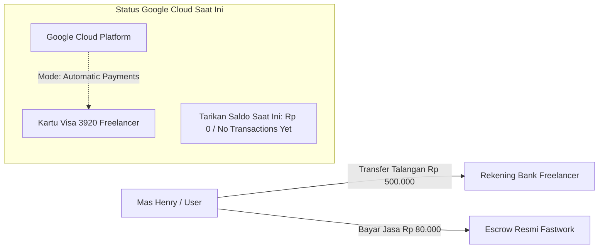
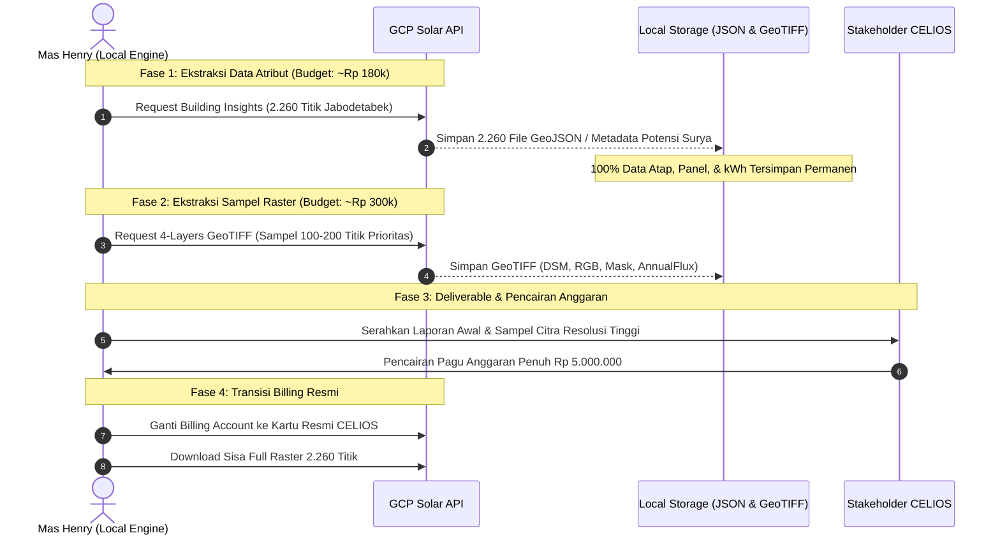

# LAPORAN LENGKAP: STATUS AKTIVASI BILLING GCP, AUDIT KEUANGAN, DAN STRATEGI EKSEKUSI SOLAR API CELIOS

**Dokumen Referensi:** Riset Potensi Energi Surya Jabodetabek (CELIOS)  
**Tanggal:** 1 Oktober 2026  
**Penulis:** Fullstack Data Engineer — Riset Energi Surya CELIOS  
**Status Proyek:** Billing Active (Paid Account), Solar API Enabled (Smoke Test: 200 OK)

---

## 1. RINGKASAN EKSEKUTIF (EXECUTIVE SUMMARY)

Laporan ini menyajikan dokumentasi komprehensif mengenai kronologi teknis, audit keuangan, tata kelola akun penagihan (*Cloud Billing Account*), mitigasi risiko perbankan, serta strategi eksekusi pengambilan data Google Solar API untuk proyek riset CELIOS (2.260 titik se-Jabodetabek).

### Status Terkini Sistem:
* **GCP Project ID:** `celios-konfilkmonitor3` (Project Number: `753826834840`)
* **Project Owner (Super User):** `dunia.fullstackdev@gmail.com` (Kendali penuh 100% atas source code, API keys, dan data).
* **Billing Account Aktif:** `DH-Fastwork Billing 2` (ID: `013D15-96E467-78B119`)
* **Status Penagihan Project:** `billingEnabled: true` (Resmi Terhubung).
* **Struktur Peran Billing & IAM:**
  * **Billing Account Administrator (`roles/billing.admin`):** `suciarkana03@gmail.com` (Freelancer — memegang hak administratif akun penagihan).
  * **Billing Account Viewer (`roles/billing.viewer`):** `dunia.fullstackdev@gmail.com` (Mas Henry — memegang hak audit biaya, mutasi, dan laporan).
* **Metadata Profil Pembayaran (Google Payments Profile):**
  * **Payments Account ID:** `4899-9199-0847-3814`
  * **Payments Account Nickname:** `Google Cloud 013D15-96E467-78B119`
  * **Payments Profile ID:** `8252-7990-5659`
  * **Account Type:** `Individual`
  * **Nama Kontak Utama:** `WIDYA FIRMANSYA` (Verified on Jun 19, 2024)
  * **Alamat Terdaftar:** `JL. ANGGREK GG. 2A LK. KRAJAN RT 003 RW 003 PATOKAN, SITUBONDO, Jawa Timur 68312` (Verified)
  * **Informasi Pajak (Tax Info):** Personal — NIK: `3512070509930002` (Verified)
  * **Payments Users (Email Notifikasi Tagihan):** `suciarkana03@gmail.com` (Receives all payments email)
* **Mode Penagihan Google:** **`Automatic payments` (Pascabayar / Pay-as-you-go)**.
* **Ambang Batas Penagihan (*Threshold*):** IDR 1.000.000 atau tanggal 1 setiap bulan.
* **Instrumen Kartu Terdaftar:** `Visa .... 3920` (Kartu pribadi freelancer).
* **Solar API (`solar.googleapis.com`):** **ENABLED**.
* **API Key Aktif:** `Celios-Solar-API-Key` (UID: `9321cdc8-47c0-4bca-b9bd-13292adcc2bb`).
* **Hasil Smoke Test Endpoint Live:** **`HTTP 200 OK`** (Terverifikasi sukses memanggil data gedung).

---

## 2. KRONOLOGI FORENSIK TEKNIS & PROSES AKTIVASI

### 2.1. Kendala Awal: Penolakan Kartu VCC Bank Jago (`OR_BACR2_59`)
Pada tahap inisiasi, penautan kartu debit virtual (Bank Jago VCC) ditolak oleh sistem keamanan perbankan Google Payments dengan kode error `OR_BACR2_59`. Google Cloud Indonesia menerapkan verifikasi ketat pada BIN perbankan lokal, di mana kartu berbasis *prepaid virtual card* sering diblokir secara otomatis untuk mencegah pembuatan akun bot.

### 2.2. Pelibatan Jasa Freelancer Fastwork (Sesi Remote AnyDesk)
Untuk mempercepat aktivasi tanpa menunggu kartu kredit fisik diterbitkan, user menggunakan jasa aktivasi kartu kredit di Fastwork (biaya jasa Rp 80.000) dengan akun freelancer `suciarkana03@gmail.com`.

Dalam pelaksanaannya:
1. **Analisis Error "No available billing accounts":**  
   Pada video/tangkapan layar awal, freelancer tidak dapat menautkan billing karena 3 akun penagihan miliknya (`Dh-Upwork Billing`, `My Billing Account`, `My Billing Account 1`) berstatus **`Closed`**.
2. **Kendala Pop-up "One-time IDR 500,000 prepayment required":**  
   Saat freelancer menginput kartu barunya (`Visa .... 3920`), Google mendeteksi sistem pembayaran Indonesia dan memunculkan syarat deposit di muka sebesar **Rp 500.000**.
3. **Penyelarasan Limit Transaksi Kartu:**  
   Freelancer sebelumnya membatasi (*setting limit*) kartunya hanya Rp 80.000. Agar verifikasi Google tidak ditolak oleh bank karena limit kurang, disepakati limit dinaikkan sementara di m-banking menjadi Rp 500.000 - Rp 600.000, didukung dana talangan Rp 500.000 dari user.
4. **Keberhasilan Registrasi Billing:**  
   Setelah formulir disubmit dan diverifikasi, akun billing `DH-Fastwork Billing 2` berhasil dibuat dan ditautkan ke project `celios-konfilkmonitor3`.

---

## 3. AUDIT KEUANGAN & STATUS ALIRAN DANA (FINANCIAL FORENSIC)

Berdasarkan inspeksi mendalam pada Google Cloud Console (`console.cloud.google.com/billing/013D15-96E467-78B119/profile`), ditemukan fakta perbankan yang sangat krusial:

### 3.1. Posisi Uang Rp 500.000
1. **Google TIDAK Memotong Rp 500.000 di Awal:**  
   Meskipun sempat muncul pop-up deposit, akun penagihan resmi disetujui Google dengan skema **`Automatic payments` (Pascabayar)**.
   * Bukti: Pada menu *Transactions*, status tercatat **`No transactions yet`** dan *Total cost* adalah **`Rp 0`**.
   * Bukti: Pada menu *Payment settings*, tertulis: *"You'll be charged automatically on the 1st of each month. If your balance reaches your IDR 1,000,000 payment threshold before then, you'll be charged immediately."*
2. **Uang Rp 500.000 Berada Utuh di Rekening Freelancer:**  
   Dana Rp 500.000 yang ditransfer oleh Mas Henry saat ini tersimpan utuh sebagai uang tunai di rekening bank si freelancer.
3. **Fungsi Dana Tersebut:**  
   Dana ini sah berfungsi sebagai **dana talangan (*buffer reimbursement*)** bagi si freelancer. Ketika script Solar API dijalankan, Google akan menagih biaya pemakaian secara pascabayar ke kartu `Visa .... 3920`. Freelancer menggunakan uang 500k tersebut untuk membayar tagihan Google yang masuk ke kartunya.

### 3.2. Status Free Trial
* Pada menu **Credits**, tercatat **`No credits to display`**.
* **Penyebab:** Profil penagihan tertaut ke profil pembayaran terverifikasi milik Mas Henry (`WIDYA FIRMANSYA`, terverifikasi sejak 19 Juni 2024). Karena profil ini bukan pengguna baru, kuota promo Free Trial $300 tidak diterbitkan.
* **Konsekuensi:** Akun beroperasi murni sebagai **Paid Account (Pay-as-you-go)**. Setiap panggilan API akan dikenakan biaya sesuai tarif resmi Google Solar API.

### 3.3. Rincian Konfigurasi Profil Pembayaran & Administrator Penagihan
Berdasarkan data resmi pada panel *Payment Settings* (`console.cloud.google.com/billing/013D15-96E467-78B119/profile`):

| Komponen Konfigurasi | Nilai Parameter di Google Cloud | Keterangan & Implikasi |
| :--- | :--- | :--- |
| **Payments Account ID** | `4899-9199-0847-3814` | ID unik akun penagihan di Google Payments |
| **Payments Account Nickname**| `Google Cloud 013D15-96E467-78B119` | Label asosiasi ke Cloud Billing Account |
| **Payments Profile ID** | `8252-7990-5659` | Profil legal pembayaran terdaftar |
| **Account Type** | `Individual` (Pribadi) | Bukan profil korporasi (*Business*) |
| **Nama Kontak Legal** | `WIDYA FIRMANSYA` | Terverifikasi sejak 19 Juni 2024 (*Verified*) |
| **Alamat Terdaftar** | `Jl. Anggrek Gg. 2A Lk. Krajan RT 003 RW 003 Patokan, Situbondo, Jatim 68312` | Terverifikasi alamat domisili resmi |
| **Nomor Induk Kependudukan (NIK)** | `3512070509930002` | Status Pajak: *Personal Verified* |
| **Bahasa Dokumen** | `Indonesian · Indonesia` | Faktur/invoice bulanan berbahasa Indonesia |
| **Payments Users (Penerima Email)** | `suciarkana03@gmail.com` | Email freelancer diset sebagai penerima invoice & notifikasi tagihan |
| **Metode Pembayaran Utama** | `Visa .... 3920` | Kartu milik freelancer yang menanggung penagihan pascabayar |
| **Aturan Penagihan (*How You Pay*)** | **`Automatic payments`** | Ditagih setiap tanggal 1 atau saat akumulasi mencapai **Rp 1.000.000** |

#### Pembagian Hak Akses (IAM Roles) pada Billing:
* **`suciarkana03@gmail.com` (Freelancer):** Memegang peran **`Billing Account Administrator`** dan **`Payments user`**. Memiliki otoritas menerima notifikasi tagihan dari Google dan mengelola instrumen kartu kreditnya.
* **`dunia.fullstackdev@gmail.com` (Mas Henry):** Memegang peran **`Billing Account Viewer`** pada billing account, serta **`Owner` (Pemilik Mutlak)** pada project `celios-konfilkmonitor3`. Memiliki otoritas 100% menjalankan API, menerbitkan API Key, mengakses data, dan memantau biaya secara transparan.

---

## 4. KORELASI RAB CELIOS (RP 5.000.000) VS PILOT BUDGET (RP 500.000)

Terdapat perbedaan mendasar antara dokumen anggaran resmi CELIOS dengan akun penagihan freelancer saat ini yang **WAJIB DIFAHAMI AGAR TIDAK TERJADI KERUSAKAN SISTEM**:

| Parameter | Dokumen RAB Resmi CELIOS (`2026-09-27`) | Akun Pilot Freelancer Saat Ini |
| :--- | :--- | :--- |
| **Total Pagu Anggaran** | **Rp 4.994.064 (~Rp 5.000.000)** | **Maksimal Rp 500.000** |
| **Penanggung Dana** | Lembaga CELIOS (Riset Hibah/Proyek) | Dana Talangan Mas Henry |
| **Kartu Pembayaran** | Kartu Kredit Resmi Korporat Celios | Kartu Pribadi Freelancer (`Visa .... 3920`) |
| **Cakupan Data** | 2.260 titik Building Insights + 4 Layers GeoTIFF Raster AnnualFlux (Full) | 2.260 titik Building Insights (Full) + Sampel GeoTIFF Terpilih |

### ⚠️ PERINGATAN KERAS RISIKO OVER-BUDGET:
* **DILARANG KERAS** menjalankan penarikan full 4-layer raster GeoTIFF untuk seluruh 2.260 titik di akun freelancer ini!
* Biaya full 2.260 titik GeoTIFF adalah ~$316 USD (Rp 5 Juta).
* Jika ditagihkan ke akun ini, bank freelancer akan menolak transaksi (karena limit kartu hanya 600k), akun GCP akan **dibekukan (*suspended*)** oleh Google, dan kartu freelancer mengalami gagal bayar.

### 💡 DAYA JANGKAU SALDO RP 500.000 SAAT INI:
1. **Building Insights (Data Atribut Atap, Potensi kWh, Jumlah Panel):**
   * Tarif Google: **$0.005 per titik**.
   * Total 2.260 titik = 2.260 × $0.005 = **$11.30 USD (~Rp 178.500)**.
   * **Kesimpulan:** Seluruh 2.260 titik se-Jabodetabek (13 Kategori) **BISA DIAMBIL 100% LENGKAP** hanya dengan biaya ~Rp 180.000!
2. **Sisa Saldo Cadangan (~Rp 321.500):**
   * Dapat digunakan untuk mengambil sampel citra satelit GeoTIFF (AnnualFlux 4-Layers @ $0.100/titik) untuk **~200 titik fasilitas prioritas utama** sebagai bahan mockup dan visualisasi awal laporan.
3. **Eksekusi Sisa GeoTIFF Penuh:**
   * Dilakukan setelah CELIOS mencairkan anggaran resmi Rp 5.000.000 dan kartu resmi Celios dimasukkan menggantikan kartu freelancer.

---

## 5. STRATEGI DEALING & MANAJEMEN FREELANCER (DURASI 1-2 MINGGU)

Mas Henry telah diberikan role **`Billing Account Viewer`** pada akun `DH-Fastwork Billing 2`. Ini memberikan transparansi penuh untuk memantau pengeluaran tanpa memicu konflik perizinan.

### 5.1. Klausul Kesepakatan dengan Freelancer
Agar freelancer tidak menutup (*close*) akun secara sepihak selama proses riset 1–2 minggu:
1. **Penyelesaian Order Fastwork:**  
   Selesaikan pesanan di Fastwork dan berikan review bintang 5 sebagai bentuk pemenuhan kewajiban atas jasa aktivasi yang telah sukses.
2. **Komitmen Durasi Aktif 14 Hari:**  
   Freelancer sepakat membiarkan akun billing tetap berstatus **Active** selama minimal 14 hari ke depan untuk proses penarikan data bertahap.
3. **Jaminan Batas Pemakaian:**  
   Mas Henry menjamin total penagihan tidak akan melebihi Rp 500.000 (sesuai dana yang telah ditransfer ke rekeningnya).
4. **Prosedur Penutupan Akun di Akhir Proyek:**  
   Setelah seluruh data 2.260 titik selesai didownload ke harddisk lokal Mas Henry, Mas Henry akan memberi kabar resmi ke freelancer bahwa akun billing sudah aman untuk ditutup (*closed*) jika freelancer menghendaki.

---

## 6. ROADMAP EKSEKUSI DATA (IMMEDIATE ACTION PLAN)

### Checklist Teknis Eksekusi:
- [x] Billing Account tertaut dan aktif (`billingEnabled: true`).
- [x] Solar API diaktifkan (`solar.googleapis.com`).
- [x] API Key diterbitkan (`Celios-Solar-API-Key`).
- [x] Verifikasi Smoke Test endpoint berhasil (`HTTP 200 OK`).
- [x] Laporan audit keuangan dan status akun didokumentasikan di `docs/`.
- [ ] Konfigurasi `.env` pada folder `tools/solarapi`.
- [ ] Eksekusi batch script pengambilan 2.260 titik Building Insights se-Jabodetabek.
- [ ] Validasi integritas spasial output (GeoJSON / CSV agregat).
