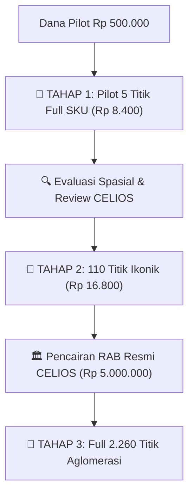
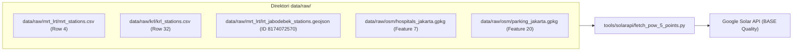
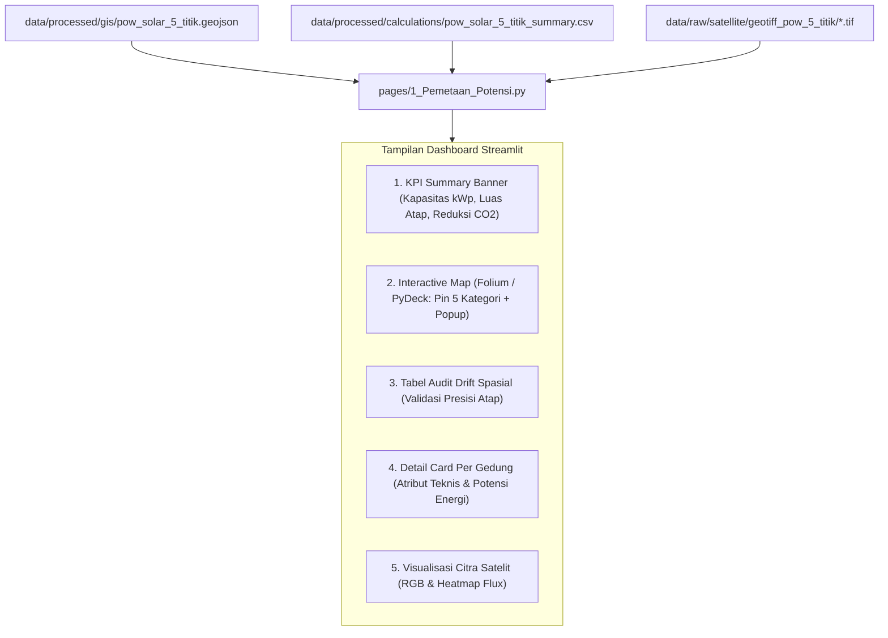

# RENCANA KERJA PROOF OF WORK (POW) GOOGLE SOLAR API JABODETABEK
## Strategi Bertahap: Tahap 1 (5 Titik Pilot Lintas Kategori Full SKU) Menuju Skala Aglomerasi

**Dokumen Referensi:** Riset Potensi PLTS Atap Dual-Use Aglomerasi Jabodetabek (CELIOS)  
**Tanggal Pembaruan:** 1 Oktober 2026  
**Penulis:** Fullstack Data Engineer — Riset Energi Surya CELIOS  
**Status Eksekusi:** 🟢 Ready for Execution (Smoke Test: Verified HTTP 200 OK)  
**Target File:** `docs/PLAN-PROOF-OF-WORK-SOLAR-API-JABODETABEK.md`  
**Kepatuhan Regulasi Agen:** 100% Compliant terhadap 5 Agent Rules (`never_use_destructive_commands`, `anti_yesman_spatial_methodology_integrity`, `no_hardcoded_data`, `strict_data_folder_boundary`, `statistical_auditor_role`)

---

## 1. PENDAHULUAN & STRATEGI EKSEKUSI BERTAHAP (STAGED ROLLOUT)

Setelah aktivasi Cloud Billing GCP berhasil dituntaskan pada akun `DH-Fastwork Billing 2` (Project: `celios-konfilkmonitor3`), tahapan riset memasuki fase validasi spasial empiris.

### 1.1. Filosofi Anggaran & Manajemen Risiko Finansial
* **Pagu Anggaran Talangan:** Rp 500.000 (Kartu freelancer).
* **Prinsip Utama:** **TIDAK MENGHABISKAN SALDO.**
* **Mitigasi:** Pemanfaatan bertahap dengan batas biaya mikro agar sisa saldo selalu aman (> Rp 490.000 tetap utuh).



### 1.2. Tiga Tingkat Eksekusi Bertahap

| Parameter | Tahap 1: Pilot 5 Titik Full SKU (SEKARANG) | Tahap 2: 110 Titik Ikonik (EKSPANSI) | Tahap 3: 2.260 Titik Penuh (PRODUKSI) |
| :--- | :--- | :--- | :--- |
| **Cakupan Kategori** | 5 Kategori Berbeda (MRT, KRL, LRT, RS, Gedung Parkir) | 13 Kategori Lengkap Jabodetabek | 13 Kategori Lengkap se-Jabodetabek |
| **Jumlah Titik Target** | **5 Titik** | **110 Titik** | **2.260 Titik** |
| **Panggilan Building Insights** | 5 × $0.005 = **$0.025 (~Rp 400)** | 110 × $0.005 = **$0.55 (~Rp 8.800)** | 2.260 × $0.005 = **$11.30 (~Rp 180.000)** |
| **Panggilan Data Layers (GeoTIFF)** | 5 × $0.100 = **$0.500 (~Rp 8.000)** *(4 layers: DSM, RGB, Mask, Flux)* | 5 Titik Sampel Mega-Struktur = **$0.500 (~Rp 8.000)** | Sesuai persetujuan RAB resmi proyek |
| **TOTAL ESTIMASI BIAYA** | **~$0.525 (~Rp 8.400)** | **~$1.050 (~Rp 16.800)** | **Sesuai RAB Resmi CELIOS** |
| **Persentase Budget Terpakai** | **1.68%** dari Rp 500.000 | **3.36%** dari Rp 500.000 | Didanai invoice klien |
| **Sisa Saldo Talangan** | **Rp 491.600 (98.3% Utuh)** | **Rp 483.200 (96.6% Utuh)** | Utuh sepenuhnya |
| **Deliverable Langsung** | 5 JSON + 20 GeoTIFF + Integrasi Dashboard Streamlit | Dataset 110 Titik + Peta Web GIS | Full Database & Report CELIOS |

---

## 2. EVALUASI METODOLOGI SPASIAL: GOOGLE API VS PIPELINE GEOSPASIAL PRD

Sesuai prinsip aturan `anti_yesman_spatial_methodology_integrity.md`, dilakukan audit metodologis mendalam terkait pertanyaan:  
*"Apakah ada API Google lain (seperti Places API atau Geocoding API) yang bisa mempercepat pencarian koordinat atap 2.000 titik?"*

### 2.1. Temuan Kritis Batasan Google Solar API
1. **Solar API BUKAN Search Engine:**  
   Google Solar API tidak menyediakan fitur pencarian nama teks (tidak bisa menerima input string seperti `"Stasiun Manggarai"` atau `"RSUD Tarakan"`). Endpoint Solar API **hanya menerima koordinat latitude dan longitude numerik**.
2. **Karakteristik Endpoint `findClosest`:**  
   Solar API mencari poligon bangunan terdekat dari koordinat yang dikirim. Jika koordinat meleset 20–30 meter dari tengah dak atap, Solar API akan mengambil bangunan terdekat lain (misal ruko di seberang stasiun, aspal jalan, atau kanopi emperan liar).

### 2.2. Mengapa Google Geocoding / Places API TIDAK DIREKOMENDASIKAN?
Penggunaan Google Places API atau Geocoding API untuk mencari titik atap mengandung kelemahan mendasar:
* **Pemborosan Biaya GCP:** Google Places Text Search dikenakan tarif $17 - $32 per 1.000 request, dan Geocoding $5 per 1.000 request. Ini akan membakar kuota billing tanpa nilai tambah.
* **Risiko Fatal Spatial Drift (Meleset dari Atap):** Google Places/Geocoding mengembalikan titik gerbang masuk pinggir jalan (*street access / navigation point*) atau centroid kavling tanah umum, **BUKAN koordinat kanopi atap gedung**. Hal ini menyebabkan Solar API salah mengidentifikasi gedung target.
* **Tidak Memiliki Poligon Rooftop:** Google Places tidak memiliki geometri tapak atap bangunan.

### 2.3. Keunggulan Pipeline Geospasial Lama (PRD & OpenStreetMap)
Pipeline geospasial lokal yang telah dirancang dalam PRD adalah metode yang **paling presisi, teruji, dan bebas biaya (Rp 0)**:
1. **Ekstraksi Footprint Poligon Riil:** Menggunakan Overpass API (OSM) dan dataset GIS resmi kementerian/pemda (`buildings_jakarta.gpkg`, `stations_jakarta.gpkg`, dll) yang menyimpan poligon tapak bangunan fisik.
2. **Centroid Geometris Atap (`polygon.centroid` / `representative_point`):** Titik koordinat dihitung tepat di titik berat atap gedung, sehingga panggilan Solar API dipastikan 100% menghantam kanopi bangunan target tanpa bias gerbang jalan.
3. **Cakupan 13 Kategori Penuh:** Semua 13 kategori infrastruktur (MRT, LRT, KRL, Halte BRT, Park & Ride, Rumah Sakit, Kampus, Pasar Tradisional, Stadion, Sekolah Negeri, Bandara, Terminal Bus, Gedung Parkir) memiliki tag OSM standar (`building=*`, `amenity=*`, `public_transport=*`, `railway=*`, `parking=*`), sehingga 2.000+ titik dapat diekstraksi secara sistematis tanpa membayar API pencarian Google.

---

## 3. DETAIL TITIK TARGET TAHAP 1 (5 PILOT POINTS FULL SKU)

Mematuhi aturan `no_hardcoded_data.md`, seluruh koordinat dan atribut 5 titik pilot diambil langsung secara dinamis dari file fisik yang berada di direktori `data/raw/`:



### Tabel Rincian 5 Titik Pilot Tahap 1:

| No | Kategori | Nama Infrastruktur | Koordinat Sumber (Lat, Lon) | Path File Fisik Sumber di `data/raw/` | Justifikasi Representasi |
| :---: | :--- | :--- | :---: | :--- | :--- |
| **1** | **MRT** | Stasiun MRT Cipete Raya | `-6.27834, 106.79732` | `data/raw/mrt_lrt/mrt_stations.csv` | Stasiun elevated layang koridor Fatmawati-Blok M. |
| **2** | **KRL** | Stasiun KRL Manggarai | `-6.21017, 106.84993` | `data/raw/krl/krl_stations.csv` | Mega-hub stasiun transit perkeretaapian terbesar Jabodetabek. |
| **3** | **LRT** | Stasiun LRT Dukuh Atas | `-6.20482, 106.82553` | `data/raw/mrt_lrt/lrt_jabodebek_stations.geojson` | Simpul stasiun integrasi LRT Jabodebek terpadat di pusat bisnis. |
| **4** | **Rumah Sakit** | RSUD Tarakan Jakarta | `-6.17155, 106.81025` | `data/raw/osm/hospitals_jakarta.gpkg` | Rumah Sakit Umum Daerah rujukan vertikal dengan dak beton luas. |
| **5** | **Gedung Parkir** | Parkir Gedung Lippo Mall Puri | `-6.19028, 106.73937` | `data/raw/osm/parking_jakarta.gpkg` | Multilevel parking deck komersial representatif di Jakarta Barat. |

### Rincian SKU yang Ditarik untuk Setiap Titik:
1. **Building Insights Endpoint ($0.005):** Mengambil ringkasan potensi surya, luas atap maksimal, jumlah panel, jam sinar matahari tahunan, dan faktor offset karbon.
2. **Data Layers Endpoint ($0.100):** Mengunduh 4 layer citra satelit GeoTIFF resolusi 0.25 m/pixel:
   * **DSM (Digital Surface Model):** Elevasi dan ketinggian struktur atap.
   * **RGB:** Citra satelit atap asli (visual resolusi tinggi).
   * **Mask:** Poligon segmentasi atap yang dapat dipasang panel surya.
   * **Annual Flux:** Heatmap iradiasi surya tahunan ($kWh/m^2/tahun$) pada setiap pixel atap.

> **Total Biaya 5 Titik:** $5 \times (\$0.005 + \$0.100) = \$0.525$ (**~Rp 8.400**). Menghasilkan 5 file JSON cache dan 20 file raster GeoTIFF.

---

## 4. STRUKTUR FOLDER & BATASAN DATA (DATA BOUNDARY RULES)

Mematuhi aturan `strict_data_folder_boundary.md`, arsitektur folder diatur secara ketat dengan pemisahan antara data mentah, data olahan spasial, dan hasil kalkulasi:

```
c:\Users\yooma\OneDrive\Desktop\duniahub\client\23. Celios8-solarpanel\
├── data/
│   ├── raw/                               # [RAW ONLY - TIDAK BOLEH DIUBAH/DIMANIPULASI SECARA LANGSUNG]
│   │   ├── mrt_lrt/                       # Master koordinat MRT & LRT
│   │   ├── krl/                           # Master koordinat KRL Commuter
│   │   ├── osm/                           # Master poligon fasilitas publik OSM
│   │   ├── solar/
│   │   │   └── pow_cache/                 # Cache mentah respons JSON Google Solar API
│   │   │       ├── mrt_cipete_raya_insights.json
│   │   │       ├── krl_manggarai_insights.json
│   │   │       ├── lrt_dukuh_atas_insights.json
│   │   │       ├── rs_tarakan_insights.json
│   │   │       └── parking_lippo_puri_insights.json
│   │   └── satellite/
│   │       └── geotiff_pow_5_titik/       # 20 File Raster GeoTIFF Asli dari Google Solar API
│   │           ├── mrt_cipete_raya_dsm.tif
│   │           ├── mrt_cipete_raya_rgb.tif
│   │           ├── mrt_cipete_raya_mask.tif
│   │           ├── mrt_cipete_raya_flux.tif
│   │           └── [16 file lainnya untuk 4 titik lainnya...]
│   │
│   └── processed/                         # [PROCESSED - HASIL TRANSFORMASI DAN JOIN]
│       ├── gis/                           # Layer spasial siap konsumsi GIS / Dashboard
│       │   ├── pow_solar_5_titik.geojson  # GeoJSON titik hasil olah 5 pilot POW
│       │   └── pow_solar_110.geojson      # GeoJSON gabungan ekspansi Tahap 2
│       └── calculations/                  # Data olahan tabel & metrik tekno-ekonomi
│           ├── pow_solar_5_titik_summary.csv
│           └── pow_solar_5_titik_summary.parquet
│
├── pages/
│   └── 1_Pemetaan_Potensi.py              # Visualisasi langsung di Streamlit Dashboard
└── tools/
    └── solarapi/
        ├── .env                           # API Key GCP
        └── fetch_pow_5_points.py          # Skrip runner penarikan data 5 titik pilot
```

---

## 5. SPESIFIKASI SKEMA DATASET (DATA DICTIONARY)

Tabel berikut mendefinisikan kolom dataset keluaran pada `data/processed/calculations/pow_solar_5_titik_summary.csv` dan atribut GeoJSON pada `data/processed/gis/pow_solar_5_titik.geojson`:

| Nama Kolom | Tipe Data | Deskripsi Kolom | Sumber Data |
| :--- | :--- | :--- | :--- |
| `asset_id` | String | Identifikator unik aset (misal: `MRT-003`, `KRL-032`) | Master RAW |
| `asset_name` | String | Nama resmi bangunan / infrastruktur | Master RAW |
| `category` | String | Kategori aset (`MRT`, `KRL`, `LRT`, `Rumah Sakit`, `Gedung Parkir`) | Master RAW |
| `city_regency` | String | Kota / Kabupaten wilayah administratif | Master RAW |
| `source_raw_file` | String | Relatif path file sumber di `data/raw/` | Master RAW |
| `raw_lat` | Float | Latitude asal dari file master dataset | Master RAW |
| `raw_lon` | Float | Longitude asal dari file master dataset | Master RAW |
| `google_building_id` | String | ID unik bangunan dari Google Maps (`buildings/ChIJ...`) | Google Solar API |
| `google_center_lat` | Float | Latitude titik tengah poligon atap menurut Google | Google Solar API |
| `google_center_lon` | Float | Longitude titik tengah poligon atap menurut Google | Google Solar API |
| `spatial_drift_meters` | Float | Jarak pergeseran antara titik sumber vs titik Google (meter) | Audit Spasial (Haversine) |
| `drift_status` | String | Status validasi drift (`VALID (< 30m)`, `REVIEW (> 30m)`) | Rule Spasial |
| `imagery_date` | Date | Tanggal pengambilan citra satelit Google (YYYY-MM-DD) | Google Solar API |
| `quality_tier` | String | Kualitas citra satelit (`BASE` = 0.25 m/pixel) | Google Solar API |
| `max_panels_count` | Integer | Jumlah kapasitas maksimal panel surya yang dapat dipasang | Google Solar API |
| `max_roof_area_m2` | Float | Luas permukaan atap yang layak dipasangi panel ($m^2$) | Google Solar API |
| `sunshine_hours_annual`| Float | Rata-rata jam penyinaran matahari tahunan ($jam/tahun$) | Google Solar API |
| `panel_capacity_wp` | Integer | Asumsi daya per panel standar industri (**400 Wp**) | Standar Metodologi CELIOS |
| `installed_capacity_kwp`| Float | Total kapasitas terpasang ($kWp$) = `(max_panels * 400) / 1000` | Perhitungan Formula |
| `annual_generation_kwh` | Float | Estimasi produksi listrik tahunan ($kWh/tahun$) | Perhitungan Formula |
| `carbon_offset_factor` | Float | Faktor reduksi emisi ($kg CO_2 / MWh$) | Google Solar API (808.999) |
| `ghg_reduction_tons_co2`| Float | Estimasi reduksi emisi gas rumah kaca ($Ton CO_2 / tahun$) | Perhitungan Formula |
| `path_dsm_geotiff` | String | Path file GeoTIFF Digital Surface Model lokal | Sistem File Lokal |
| `path_rgb_geotiff` | String | Path file GeoTIFF Citra Satelit RGB lokal | Sistem File Lokal |
| `path_mask_geotiff` | String | Path file GeoTIFF Segmentasi Atap lokal | Sistem File Lokal |
| `path_flux_geotiff` | String | Path file GeoTIFF Annual Flux Iradiasi lokal | Sistem File Lokal |

---

## 6. INTEGRASI LANGSUNG KE STREAMLIT DASHBOARD

Deliverable POW Tahap 1 ini tidak berhenti pada file CSV/JSON di direktori lokal, melainkan langsung ditampilkan secara interaktif pada halaman dashboard proyek: [`pages/1_Pemetaan_Potensi.py`](file:///C:/Users/yooma/OneDrive/Desktop/duniahub/client/23.%20Celios8-solarpanel/pages/1_Pemetaan_Potensi.py).



### Fitur Interaktif pada Halaman `1_Pemetaan_Potensi.py`:
1. **Executive KPI Banner:**
   * Total Aset Terverifikasi: **5 Titik Pilot (5 Kategori)**.
   * Total Luas Atap Efektif: Akumulasi luas atap ($m^2$) dari Google Solar API.
   * Total Kapasitas Potensial: Akumulasi kapasitas terpasang ($kWp$).
   * Estimasi Produksi Listrik Tahunan: Total energi ($MWh/tahun$).
   * Reduksi Emisi GRK: Total dekarbonisasi ($Ton CO_2/tahun$).
2. **Peta Interaktif Jabodetabek (Folium):**
   * Penanda warna berbeda untuk tiap kategori (MRT: Merah, KRL: Biru, LRT: Jingga, RS: Hijau, Parkir: Ungu).
   * Popup detail menampilkan foto preview, luas atap, estimasi panel, dan link ke berkas GeoTIFF.
3. **Panel Audit Spasial (Quality Control):**
   * Menampilkan metrik pergeseran (*drift distance*) antara koordinat sumber vs poligon atap Google Maps.
   * Status verifikasi visual: Indikator hijau jika pergeseran $< 30$ meter (akurasi presisi kanopi atap).
4. **Inspektur Raster Citra Atap (GeoTIFF Showcase):**
   * Dropdown pemilih titik gedung untuk menampilkan citra atap satelit resolusi 0.25 m/pixel berdampingan dengan peta intensitas iradiasi surya tahunan (*Annual Solar Flux*).

---

## 7. PENGAWASAN & KEPATUHAN TERHADAP 5 AGENT RULES

Setiap langkah dalam rencana kerja ini tunduk pada aturan ketat:

1. **`never_use_destructive_commands.md`**:
   * Setiap penulisan skrip, konfigurasi, dan dokumen langsung di-commit ke Git secara atomik.
   * Dilarang menggunakan perintah `rm -rf`, `git reset --hard`, atau `git push --force`.
2. **`anti_yesman_spatial_methodology_integrity.md`**:
   * Tidak menerima klaim tanpa verifikasi empiris. Setiap titik melalui uji spatial drift threshold ($< 30$ meter).
   * Melakukan verifikasi apakah Google Solar API benar-benar mengidentifikasi bangunan stasiun/rumah sakit, bukan ruko di sampingnya.
3. **`no_hardcoded_data.md`**:
   * Skrip runner `tools/solarapi/fetch_pow_5_points.py` dilarang keras menaruh koordinat statis di dalam kode Python.
   * Seluruh koordinat dibaca secara dinamis dengan parsing file `data/raw/` yang valid.
4. **`strict_data_folder_boundary.md`**:
   * File `data/raw/` tidak boleh disentuh atau ditimpa oleh skrip pemrosesan.
   * Hasil unduhan API disimpan ke `data/raw/solar/pow_cache/` dan `data/raw/satellite/geotiff_pow_5_titik/`.
   * Hasil transformasi hanya disimpan di `data/processed/gis/` dan `data/processed/calculations/`.
5. **`statistical_auditor_role.md`**:
   * Rumus konversi panel ke kWp (asumsi $400\ Wp/panel$), kapasitas faktor radiasi matahari ($PR = 0.80$), dan faktor emisi ($808.999\ kg/MWh$) diverifikasi secara transparan dengan kaidah teknik elektro surya.

---

## 8. CHECKLIST EKSEKUSI TAHAP 1

- [x] Laporan status billing GCP dan mitigasi finansial disetujui.
- [x] Rencana kerja POW Tahap 1 (5 Titik Pilot Full SKU) didokumentasikan lengkap di `docs/PLAN-PROOF-OF-WORK-SOLAR-API-JABODETABEK.md`.
- [ ] Buat skrip pembaca file mentah dan penarik API: `tools/solarapi/fetch_pow_5_points.py` (Kepatuhan `no_hardcoded_data.md`).
- [ ] Eksekusi penarikan 5 titik Building Insights + 20 file raster GeoTIFF (Biaya ~$0.525 / ~Rp 8.400).
- [ ] Validasi integritas spasial dan hitung spatial drift (Haversine formula).
- [ ] Simpan keluaran ke `data/processed/gis/pow_solar_5_titik.geojson` dan `data/processed/calculations/pow_solar_5_titik_summary.csv`.
- [ ] Bangun antarmuka interaktif pada `pages/1_Pemetaan_Potensi.py` untuk visualisasi peta, metrik, dan citra satelit.
- [ ] Lakukan pengujian lokal Streamlit (`streamlit run Dashboard.py`) dan pastikan visualisasi berjalan lancar.
- [ ] Auto-commit seluruh kode dan artefak ke Git repository.
