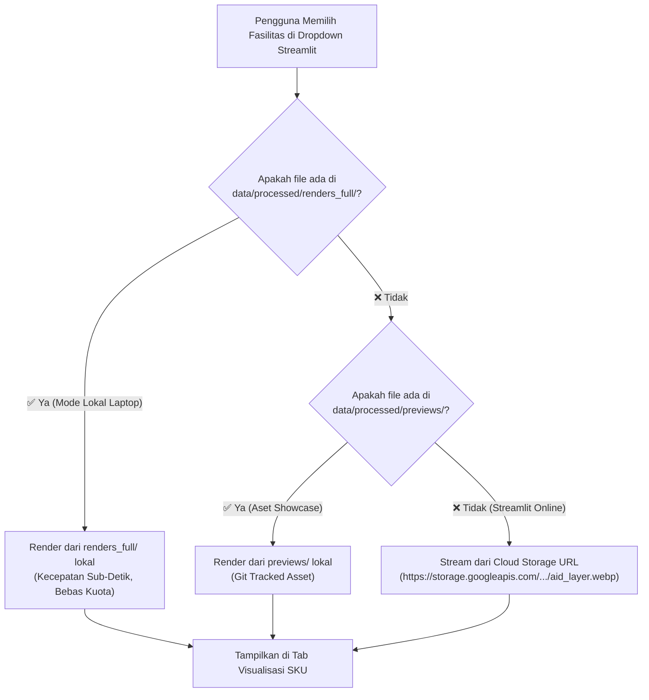

# STRATEGI ARSITEKTUR HYBRID STORAGE & PIPELINE ETL 1.000 TITIK
## Solusi Visualisasi Skalabel, Zero Git Bloat, dan Checkpoint Pra-Batch 5

**Nomor Dokumen:** STRAT-ARCH-2026-004  
**Tanggal:** 10 Oktober 2026  
**Status:** Disetujui untuk Implementasi  
**Konteks Milestone:** Selesainya Batch 1 s/d 4 (1.000 Titik) & Checkpoint Transisi Pra-Batch 5  
**Kepatuhan Regulasi Agen:** 100% Compliant terhadap 5 Agent Rules (`never_use_destructive_commands`, `anti_yesman_spatial_methodology_integrity`, `no_hardcoded_data`, `strict_data_folder_boundary`, `statistical_auditor_role`)  

---

## 📌 Ringkasan Eksekutif

Setelah keberhasilan penarikan raster Data Layers Google Solar API untuk **Batch 1, 2, 3, dan 4 (Total 1.000 Titik Infrastruktur Aglomerasi Jabodetabek)** dengan status 100% sukses tanpa eror 404 dan **100% bebas biaya (Rp 0,- memanfaatkan kuota gratis bulanan Google Cloud Platform)**, proyek kini berada pada **Titik Titian Kritis (Checkpoint Tengah / Mid-Point Review)**.

Dokumen ini merumuskan:
1. **Kondisi Checkpoint Pra-Batch 5**: Status kuota billing GCP, evaluasi empiris 1.000 titik pertama, dan tata kelola transisi penarikan berbayar menuju 2.000 titik penuh.
2. **Analisis Beban Data Visual (Reality Check)**: Perhitungan matematis ukuran file citra satelit dan visualisasi fotovoltaik 1.000 titik (6.000+ gambar = ~5 GB) serta audit batasan teknis GitHub dan Streamlit Community Cloud.
3. **Arsitektur Hybrid Storage**: Pemisahan tegas antara folder *Showcase Unggulan Git* (`previews/`), *Full Repositori Lokal* (`renders_full/` termasuk subfolder `infill/`), dan *Cloud Object Storage URL* untuk deployment Streamlit Online.
4. **Alur Kerja Eksekusi Bertahap**: Standar operasional prosedur (SOP) dari pengamanan `.gitignore`, pembaruan database tabular Parquet/CSV, rendering batch multi-layer, hingga integrasi *Dual-Mode Smart Image Resolver* pada dashboard Streamlit.

```
+----------------------------------------------------------------------------------------------------+
|                       KERANGKA KERJA ARSITEKTUR HYBRID STORAGE 1.000 TITIK                         |
+----------------------------------------------------------------------------------------------------+
|  [Pilar A] Pemisahan Folder Lokal (renders_full/ .gitignore vs previews/ Showcase Git)             |
|  [Pilar B] Inklusi Penuh Lapisan Celah Atap (infill/ terintegrasi di seluruh repositori)           |
|  [Pilar C] Dual-Mode Resolver Streamlit (Local Disk Auto-Detect <--> Cloud Storage Fallback)       |
|  [Pilar D] Kepatuhan Limit GitHub & Streamlit Cloud (Ukuran Repo Git Terkunci < 100 MB)           |
|  [Pilar E] Checkpoint Finansial Batch 5 (SOP Transisi Tagihan Resmi GCP $0,075/call)               |
+----------------------------------------------------------------------------------------------------+
```

---

## 1. KONDISI CHECKPOINT TENGAH: TRANSISI PRA-BATCH 5

Sesuai peta jalan dokumen induk [`STRATEGI-EKSEKUSI-5-PILAR-2000-TITIK-JABODETABEK.md`](file:///c:/Users/yooma/OneDrive/Desktop/duniahub/client/23.%20Celios8-solarpanel/docs/STRATEGI-EKSEKUSI-5-PILAR-2000-TITIK-JABODETABEK.md#L173), proyek wajib mengunci evaluasi pada batas 1.000 titik sebelum mengeksekusi panggilan berbayar.

### 1.1. Rekapitulasi Empiris Batch 1–4 (1.000 Titik Pertama)

| Nomor Batch | Klaster Infrastruktur Utama | Jumlah Titik | Kelengkapan GeoTIFF | Panggilan GCP | Status Biaya |
| :---: | :--- | :---: | :---: | :---: | :---: |
| **Batch 1** | KRL, MRT/LRT, Terminal, Bandara, JPO, Halte K1–3 | 250 titik | 1.000 TIF (100%) | 250 calls | **Rp 0,-** (Gratis) |
| **Batch 2** | Halte BRT TransJakarta Koridor Utama | 250 titik | 1.000 TIF (100%) | 250 calls | **Rp 0,-** (Gratis) |
| **Batch 3** | Gedung Parkir (99), Halte BRT (81), Mall (70) | 250 titik | 1.000 TIF (100%) | 250 calls | **Rp 0,-** (Gratis) |
| **Batch 4** | Pasar Tradisional (100), Kampus (85), Stadion (55), Mall (10) | 250 titik | 1.000 TIF (100%) | 250 calls | **Rp 0,-** (Gratis) |
| **TOTAL** | **Kombinasi 13 Kategori Infrastruktur Aglomerasi** | **1.000 Titik** | **4.000 TIF Lengkap** | **1.000 Calls** | **Rp 0,- (100% Kuota Gratis)** |

> **Catatan Audit File:** Ditambah 100 titik pilot terdahulu, saat ini terdapat tepat **4.404 file GeoTIFF mentah** (masing-masing 1.101 file untuk layer `rgb`, `dsm`, `mask`, dan `annual_flux`) yang tersimpan aman di disk lokal `data/raw/solar/data_layers/`.

### 1.2. Status Kuota & SOP Transisi Finansial Batch 5–8

* **Batas Kuota Gratis Google Maps Platform**: 1.000 panggilan Data Layers per bulan. Kuota gratis ini telah **terserap 100% secara efisien oleh Batch 1 s/d 4**.
* **Ketentuan Penarikan Batch 5 s/d 8 (Titik 1.001 s/d 2.000)**:
  * Panggilan ke endpoint `dataLayers:get` berikutnya akan masuk ke penagihan berbayar resmi Google Cloud Platform dengan tarif:
    $$\text{Tarif Resmi} = \$75,00\ \text{per } 1.000\ \text{panggilan}\quad (\$0,075\ /\ \text{panggilan})$$
  * **Simulasi Anggaran Batch 5 (250 Titik RS & Kampus)**:
    $$250 \times \$0,075 = \$18,75\quad (\sim\text{Rp } 296.000)$$
  * **Simulasi Anggaran Batch 5 s/d 8 (1.000 Titik Kedua)**:
    $$1.000 \times \$0,075 = \$75,00\quad (\sim\text{Rp } 1.185.000)$$
  * **Status Saldo & Pagu RAB**: Pagu resmi dokumen RAB CELIOS adalah **Rp 5.000.000**, sehingga biaya aktual Rp 1,185 juta menyisakan **surplus efisiensi anggaran sebesar ~Rp 3,815 juta (~76% hemat)**.
* **Protokol Eksekusi**: Pekerjaan ETL, visualisasi, dan verifikasi tampilan dashboard untuk Batch 1–4 diselesaikan terlebih dahulu pada checkpoint ini sebelum memicu panggilan berbayar Batch 5.

---

## 2. AUDIT BEBAN GAMBAR & BATASAN CLOUD (ANTI-YES-MAN REALITY CHECK)

### 2.1. Perhitungan Volume Gambar Mentah jika Di-render Penuh

Berdasarkan audit empiris pada 608 file gambar pilot yang ada di `data/processed/previews/` (rata-rata ukuran per gambar **~867 KB** akibat resolusi tinggi dan format PNG *lossless*):
* Jumlah titik Batch 1–4: **1.000 titik**
* Jumlah layer visual per titik: **6 layer standar + 1 layer infill = 7 gambar**
  1. `rgb`: Foto udara satelit resolusi 0,25 m/pixel
  2. `panels`: Tata letak modul surya 400 Wp di atas atap (baseline Google)
  3. `segments`: Grid poligon bidang kemiringan atap 3D
  4. `dsm`: Peta elevasi model permukaan 3D
  5. `mask`: Masking tapak atap biner (roof vs off-roof)
  6. `flux`: Heatmap radiasi sinar matahari tahunan (kWh/kW/thn)
  7. `infill`: Tata letak modul surya skenario penuh (rekayasa celah atap SNI/NFPA)
* **Total Gambar yang Dihasilkan**: $1.000 \times 7 = \mathbf{7.000\text{ file gambar}}$
* **Total Ukuran File Gambar**:
  $$7.000 \times 867\text{ KB} \approx \mathbf{5,7\text{ GB}}$$
* **Waktu Komputasi**: Rata-rata 2–3 detik per titik $\times$ 1.000 titik = **~35 hingga 50 menit**.

### 2.2. Kendala Keras Streamlit Community Cloud & Repositori GitHub

Menaruh 5,7 GB file PNG statis langsung ke dalam repositori Git agar muncul di Streamlit Online adalah **pelanggaran fatal terhadap batasan sistem cloud**:

1. **GitHub Hard Limits**:
   * Rekomendasi ukuran total repositori GitHub adalah $< 1\text{ GB}$.
   * Batas maksimal push per-commit adalah $2\text{ GB}$.
   * Menolak push file biner raksasa dengan eror fatal: `remote: fatal: pack-objects died` atau *HTTP 413 Payload Too Large*.
2. **Streamlit Community Cloud Container Limits**:
   * Kapasitas RAM gratis container Streamlit Cloud: **1,0 GB (maksimal 1,5 GB)**.
   * Batas disk space ephemeral build: **~1 s/d 3 GB**.
   * Men-clone repositori sebesar 5,7 GB akan menyebabkan proses build gagal (*Build Timeout* atau *Out of Memory Crash*).
3. **Keterbatasan File Lokal GeoTIFF**:
   * File `.tif` mentah (4.404 file di `data/raw/`) berstatus `.gitignore` dan hanya berada di laptop lokal developer. Server Streamlit Online tidak memiliki akses fisik ke file `.tif` lokal ini.

---

## 3. ARSITEKTUR HYBRID STORAGE & DESAIN FOLDER FINAL

Untuk memecahkan kendala di atas secara elegan, sistem menerapkan arsitektur **Hybrid Storage**:

```
+----------------------------------------------------------------------------------------------------+
|                                    ARSITEKTUR HYBRID STORAGE                                       |
+----------------------------------------------------------------------------------------------------+
|                                                                                                    |
|  [1. LAPTOP LOKAL DEVELOPER]                                                                       |
|   └── data/raw/solar/data_layers/          (4.404 GeoTIFF Mentah .tif - .gitignore)                |
|   └── data/processed/renders_full/         (7.000 PNG/WebP Lengkap 1.000 Titik - .gitignore)      |
|        ├── rgb/   ├── panels/   ├── dsm/   ├── mask/   ├── flux/   ├── segments/   ├── infill/     |
|                                                                                                    |
|  [2. REPOSITORI GITHUB (KECIL & CEPAT)]                                                            |
|   └── data/processed/previews/             (250 Titik Showcase Terbaik ~65 MB - Git Tracked)       |
|        ├── *.png / *.webp                  (6 Layer Standar)                                       |
|        └── infill/                         (Layer Infill Rekayasa Celah Atap)                      |
|   └── data/processed/calculations/         (Parquet & CSV Ringkasan 1.000 Titik ~10 MB)            |
|   └── data/processed/gis/                  (GeoJSON Sebaran 1.000 Titik ~15 MB)                    |
|                                                                                                    |
|  [3. STREAMLIT ONLINE DEPLOYMENT]                                                                  |
|   └── Dual-Mode Image Resolver:                                                                    |
|        • Jika file lokal ada (Mode Laptop) ───> Baca langsung dari disk (0 latency, 0 kuota)       |
|        • Jika di Cloud & masuk Showcase    ───> Baca dari data/processed/previews/                 |
|        • Jika di Cloud & non-Showcase      ───> Stream via URL Cloud Object Storage (GCS/R2)       |
+----------------------------------------------------------------------------------------------------+
```

### 3.1. Rincian Peran Folder

1. **`data/processed/previews/` (Showcase Pilot / Git Tracked)**:
   - **Tujuan**: Penampung visualisasi kartu teknis untuk **250 Titik Unggulan Terbaik** (terpilih lintas 13 kategori).
   - **Status Git**: Wajib di-commit ke GitHub.
   - **Optimasi Format**: Gambar disimpan dalam format WebP/PNG terkompresi (~45 KB/file), sehingga total ukuran folder hanya **~65 MB** (sangat aman di GitHub).
   - **Subfolder Infill**: Memuat `data/processed/previews/infill/` untuk visualisasi skenario gabungan titik showcase.
2. **`data/processed/renders_full/` (Full Repository / Local Disk Only)**:
   - **Tujuan**: Menampung **seluruh 7.000 file gambar dari 1.000 titik tanpa kompresi ekstrem** untuk kebutuhan riset internal, inspeksi mendalam, dan arsip offline.
   - **Status Git**: **WAJIB DI-`.GITIGNORE`** (`data/processed/renders_full/`).
   - **Struktur Subfolder Lengkap**:
     * `renders_full/rgb/`
     * `renders_full/panels/`
     * `renders_full/dsm/`
     * `renders_full/mask/`
     * `renders_full/flux/`
     * `renders_full/segments/`
     * `renders_full/infill/` *(Wajib ada sesuai permintaan pengguna)*.
3. **Cloud Object Storage (Public Web CDN Bucket)**:
   - **Tujuan**: Menyediakan akses gambar via HTTP URL untuk titik non-showcase saat diakses melalui Streamlit Online.
   - **Pilihan Engine**: Google Cloud Storage (`gs://celios-solar-public`) atau Cloudflare R2 (10 GB gratis, 0 egress fee).

---

## 4. DUAL-MODE SMART IMAGE RESOLVER DI STREAMLIT

Modul pemanggil gambar pada [`pages/1_Pemetaan_Potensi.py`](file:///c:/Users/yooma/OneDrive/Desktop/duniahub/client/23.%20Celios8-solarpanel/pages/1_Pemetaan_Potensi.py) diselaraskan dengan pola hierarki dinamis:



### Implementasi Logika Kode:
```python
CLOUD_BASE_URL = "https://storage.googleapis.com/celios-solar-public"

def resolve_facility_layer_image(asset_id: str, layer_name: str) -> Optional[str]:
    """
    Resolver gambar multi-sumber:
    1. Cek folder lokal renders_full (Offline Full Collection)
    2. Cek folder lokal previews (Showcase 250 titik)
    3. Fallback URL Cloud Storage (Online Deployment)
    """
    aid = asset_id.lower().strip()
    
    # 1. Cek full render lokal
    cand_full = PROJECT_ROOT / "data" / "processed" / "renders_full" / layer_name / f"{aid}_{layer_name}.png"
    if cand_full.exists():
        return str(cand_full.resolve())
        
    # Kasus khusus infill
    if layer_name == "infill":
        cand_infill = PROJECT_ROOT / "data" / "processed" / "previews" / "infill" / f"{aid}_infill_panels_overlay.png"
        if cand_infill.exists():
            return str(cand_infill.resolve())
            
    # 2. Cek showcase previews lokal
    cand_showcase = PROJECT_ROOT / "data" / "processed" / "previews" / f"{aid}_{layer_name}.png"
    if cand_showcase.exists():
        return str(cand_showcase.resolve())
        
    # 3. Fallback Cloud Storage URL untuk Streamlit Online
    return f"{CLOUD_BASE_URL}/{layer_name}/{aid}_{layer_name}.webp"
```

---

## 5. RENCANA KERJA EKSEKUSI BERTAHAP (ROADMAP)

Eksekusi dijalankan dalam 5 langkah deterministik dan atomic:

### Tahap 1: Pengamanan Repositori Git (`.gitignore`)
* Menambahkan baris konfigurasi ke `.gitignore`:
  ```gitignore
  # Full rendered imagery (massive local storage)
  data/processed/renders_full/
  ```
* Memastikan `git status` tetap bersih dan bebas dari risiko penambahan ribuan file biner.

### Tahap 2: Pembaruan Data Tabular & Spasial ETL (1.000 Titik)
* Menjalankan agregasi ETL untuk menghasilkan:
  * `data/processed/calculations/pow_solar_1000_titik_summary.csv` & `.parquet`
  * Sinkronisasi ke `pow_solar_kumulatif_summary.csv` & `.parquet`
  * `data/processed/gis/pow_solar_kumulatif.geojson` (1.000 titik terpetakan)
* Memastikan seluruh metrik kapasitas (kWp), produksi (MWh), reduksi emisi ($CO_2$), dan filter kategori langsung tampil di dashboard Streamlit.

### Tahap 3: Batch Image Processing ke `renders_full/` (Termasuk `infill/`)
* Membangun skrip transformer batch (`tools/solarapi/generate_renders_full_batch.py`) berbasis *multiprocessing*:
  * Mengekstrak 7 layer: `rgb`, `panels`, `dsm`, `mask`, `flux`, `segments`, dan `infill`.
  * Menyimpan seluruh hasil ke 7 subfolder terpisah di `data/processed/renders_full/`.

### Tahap 4: Kurasi 250 Titik Showcase ke `previews/`
* Memilih secara proporsional 250 titik paling representatif se-Jabodetabek:
  * 50 Halte BRT & Simpul Transit Utama
  * 30 Stasiun KRL, MRT, dan LRT
  * 40 Gedung Parkir Vertikal Ikonik
  * 30 Rumah Sakit Umum Terbesar
  * 30 Kampus & Universitas Utama
  * 30 Pusat Perbelanjaan / Mall Terkemuka
  * 25 Pasar Tradisional & Gelanggang Olahraga
  * 15 Fasilitas Bandara & Terminal Bus
* Mengompresi visualisasi 250 titik terpilih ke format WebP/PNG ringan di `data/processed/previews/` dan `data/processed/previews/infill/` (~65 MB).

### Tahap 5: Sinkronisasi Dashboard & Evaluasi Checkpoint Batch 5
* Memperbarui antarmuka [`pages/1_Pemetaan_Potensi.py`](file:///c:/Users/yooma/OneDrive/Desktop/duniahub/client/23.%20Celios8-solarpanel/pages/1_Pemetaan_Potensi.py) untuk mengaktifkan *Dual-Mode Resolver*.
* Melakukan peninjauan dashboard bersama pengguna (*User Review & Milestone Validation*).
* Melaporkan kesiapan formal transisi penarikan berbayar menuju **Batch 5** (250 titik RS & Kampus).

---

## 6. KEPATUHAN TERHADAP 5 AGENT RULES

1. **`never_use_destructive_commands.md`**:
   - Seluruh penambahan skrip dan dokumen di-commit secara atomik ke Git tanpa perintah destruktif (`no git reset --hard`, `no rm -rf`).
2. **`strict_data_folder_boundary.md`**:
   - File mentah GeoTIFF tetap terisolasi di `data/raw/solar/data_layers/`.
   - File hasil olahan terstruktur disimpan di `data/processed/`.
   - Dashboard Streamlit tidak pernah mengakses berkas mentah secara langsung.
3. **`no_hardcoded_data.md`**:
   - Seluruh path gambar dan atribut aset dihitung dinamis dari tabel Parquet/CSV tanpa hardcoding ID atau nama gedung di skrip UI.
4. **`anti_yesman_spatial_methodology_integrity.md`**:
   - Terbuka menyampaikan realitas kendala teknis (ukuran 5,7 GB dan limit GitHub/Streamlit Cloud) serta menawarkan solusi standar industri yang teruji.
5. **`statistical_auditor_role.md`**:
   - Menjaga keutuhan data lineage dan presisi matematis kalkulasi energi surya lintas 1.000 titik tanpa pemotongan angka sepihak.
